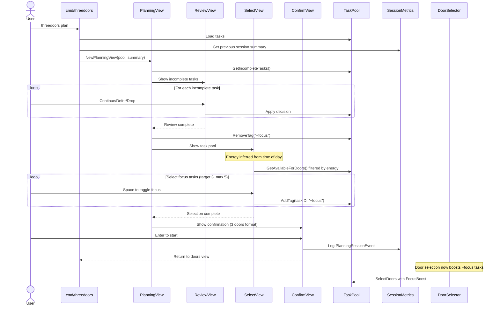

# Architecture: Daily Planning Mode (Epic 27)

**Date:** 2026-03-07
**Status:** Approved via Party Mode Consensus
**Dependencies:** Epic 1 (session tracking), Epic 3 (mood/values flows), Epic 4 (task categorization), Epic 12 (calendar awareness)

---

## Overview

Daily Planning Mode adds a guided morning planning ritual to ThreeDoors. It is a pure **TUI + Core Domain** feature — no adapter, sync, or intelligence layer changes required. The feature follows existing architectural patterns (multi-step Bubbletea flows, session metrics, tag-based task metadata).

## Architecture Decision Records

### ADR-27.1: Focus State via Session-Scoped Tags

**Decision:** Use existing `+focus` tag convention for today's focus tasks rather than adding a new field to the Task model.

**Rationale:**
- Tags are already first-class in the task model and parsed inline
- No task model migration or schema change needed
- Focus state is inherently transient (daily) — tags can be cleared on next planning session
- Consistent with existing tag patterns (`#type`, `@effort`, `+location`)

**Implementation:**
- Planning session adds `+focus` tag to selected tasks
- Next planning session clears `+focus` from all tasks before new selection
- Focus expiry: planning session timestamp + 16 hours, or next planning session

### ADR-27.2: Energy Level as Time-of-Day Default

**Decision:** Infer energy level from time of day as default, with user override.

**Rationale:**
- Reduces prompts (one fewer question in the planning flow)
- Research shows morning = high energy, post-lunch = medium, evening = low as a reasonable default
- Override available for users whose energy patterns differ
- Leverages existing `TimeContext` from calendar awareness (Epic 12)

**Mapping:**
```
06:00-11:59 → High (deep-work tasks preferred)
12:00-16:59 → Medium (medium-effort tasks preferred)
17:00-05:59 → Low (quick-win tasks preferred)
```

### ADR-27.3: Soft Progress Indicator

**Decision:** Use a soft progress indicator (step counter + elapsed time) rather than a hard timer.

**Rationale:**
- Hard timers in TUI tools feel hostile and create anxiety
- Soft nudge at 10 minutes ("You've been planning for 10 minutes") is sufficient
- No forced session termination — user ends when ready
- Progress bar shows Step 1/3, 2/3, 3/3 for flow awareness

---

## Component Design

### New Components

#### PlanningView (`internal/tui/planning_view.go`)

**Responsibility:** Orchestrate the three-step planning flow as a Bubbletea model.

**Pattern:** Composite model with sub-views (same pattern as onboarding wizard).

```go
type PlanningView struct {
    step        PlanningStep  // review | select | confirm
    reviewView  ReviewView    // Step 1: yesterday's incomplete tasks
    selectView  SelectView    // Step 2: focus task selection
    confirmView ConfirmView   // Step 3: summary and start
    startTime   time.Time     // For elapsed time tracking
    session     PlanningSession // Metrics accumulator
}

type PlanningStep int

const (
    StepReview  PlanningStep = iota
    StepSelect
    StepConfirm
)
```

**Key Interfaces:**

```go
// Exposed
func NewPlanningView(pool *TaskPool, previousSession *SessionSummary) *PlanningView
func (v *PlanningView) Update(msg tea.Msg) (tea.Model, tea.Cmd)
func (v *PlanningView) View() string

// Consumed
TaskPool.GetIncompleteTasks() []*Task           // Yesterday's incomplete
TaskPool.GetAvailableForDoors() []*Task         // Full pool for selection
TaskPool.AddTag(taskID string, tag string) error // Apply +focus tag
TaskPool.RemoveTag(tag string) error            // Clear all +focus tags
```

**State Managed:**
- `incompleteTasks` — yesterday's unfinished tasks with continue/defer/drop decisions
- `focusTasks` — selected focus tasks (max 5, default target 3)
- `energyLevel` — inferred or user-set (high/medium/low)
- `elapsed` — planning session duration
- `step` — current planning step (1-3)

#### ReviewView (`internal/tui/planning_review.go`)

**Responsibility:** Present yesterday's incomplete tasks for quick triage.

**Interactions:**
- `C` — Continue (leave in pool with focus priority consideration)
- `D` — Defer (leave in pool, no special treatment)
- `X` — Drop (mark as deferred status)
- `Enter` — Next task / proceed to Step 2 when all reviewed

**Visual:** Lipgloss-styled task card with action keys highlighted. Progress counter: "Task 2/5".

#### SelectView (`internal/tui/planning_select.go`)

**Responsibility:** Present task pool filtered by energy level for focus selection.

**Interactions:**
- `Space` — Toggle task as focus (add/remove `+focus`)
- `E` — Cycle energy level (high → medium → low → all)
- `Enter` — Confirm selection, proceed to Step 3
- Arrow keys — Navigate task list

**Visual:** Scrollable task list with energy-level filter indicator. Selected count: "Focus: 2/3 selected". Tasks sorted by energy match score.

#### ConfirmView (`internal/tui/planning_confirm.go`)

**Responsibility:** Show summary of planning decisions and start the session.

**Visual:** Three focus tasks displayed as three doors (brand consistency). Elapsed time. "Press Enter to start your day."

### Modified Components

#### DoorSelector (`internal/tasks/selection.go`)

**Change:** Add `FocusBoost` scoring coefficient for tasks tagged `+focus`.

```go
const FocusBoost = 5.0 // Significant but not absolute — user can still see non-focus tasks

func (s *DoorSelector) ScoreTask(task *Task, ctx SelectionContext) float64 {
    score := s.diversityScore(task) + s.timeContextScore(task, ctx)
    if task.HasTag("+focus") && !s.isFocusExpired(ctx.PlanningTimestamp) {
        score += FocusBoost
    }
    return score
}
```

#### SessionMetrics (`internal/tasks/metrics.go`)

**Change:** Add `planning_session` event type to JSONL schema.

```go
type PlanningSessionEvent struct {
    Type            string    `json:"type"`            // "planning_session"
    Timestamp       time.Time `json:"timestamp"`
    Duration        int       `json:"duration_seconds"`
    TasksReviewed   int       `json:"tasks_reviewed"`
    TasksContinued  int       `json:"tasks_continued"`
    TasksDeferred   int       `json:"tasks_deferred"`
    TasksDropped    int       `json:"tasks_dropped"`
    FocusTaskCount  int       `json:"focus_task_count"`
    EnergyLevel     string    `json:"energy_level"`
    EnergyOverridden bool    `json:"energy_overridden"`
}
```

#### CLI Entry Point (`cmd/threedoors/`)

**Change:** Add `plan` subcommand that launches PlanningView directly (bypasses doors view, enters planning flow).

---

## Data Flow



## File Structure

```
internal/tui/
  planning_view.go          # PlanningView composite model
  planning_view_test.go     # Table-driven state machine tests
  planning_review.go        # ReviewView sub-model
  planning_review_test.go
  planning_select.go        # SelectView sub-model
  planning_select_test.go
  planning_confirm.go       # ConfirmView sub-model
  planning_confirm_test.go

internal/tasks/
  selection.go              # Modified: add FocusBoost scoring
  selection_test.go         # Modified: test focus boost
  metrics.go                # Modified: add PlanningSessionEvent
  metrics_test.go           # Modified: test planning event logging
```

## Testing Strategy

- **Unit tests:** Table-driven tests for PlanningView state machine (step transitions, edge cases)
- **Golden file tests:** PlanningView rendering at each step (review, select, confirm)
- **Integration tests:** Full planning flow — run session, verify `+focus` tags applied, verify door selection boost
- **Edge cases:**
  - Zero incomplete tasks (skip review step, go directly to select)
  - Task pool smaller than 3 (allow fewer focus tasks)
  - Energy level with no matching tasks (fall back to showing all tasks)
  - Planning session with no focus selected (warn but allow)

## Security & Privacy

- No new external data access
- Planning sessions stored in local JSONL only (existing metrics pattern)
- No new configuration secrets or credentials
- Focus tags are local task metadata (no sync implications for external providers)

## Performance

- PlanningView renders are pure string manipulation — sub-millisecond
- Task filtering by energy level uses existing in-memory TaskPool — no I/O
- Session metrics write is a single JSONL append — same as existing pattern
- No new background processes, timers only for elapsed time display via `tea.Tick`
