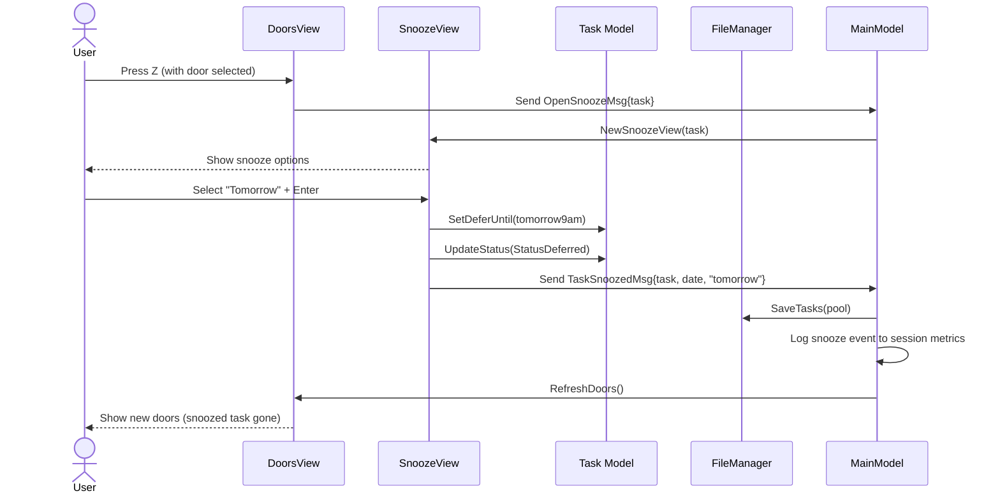
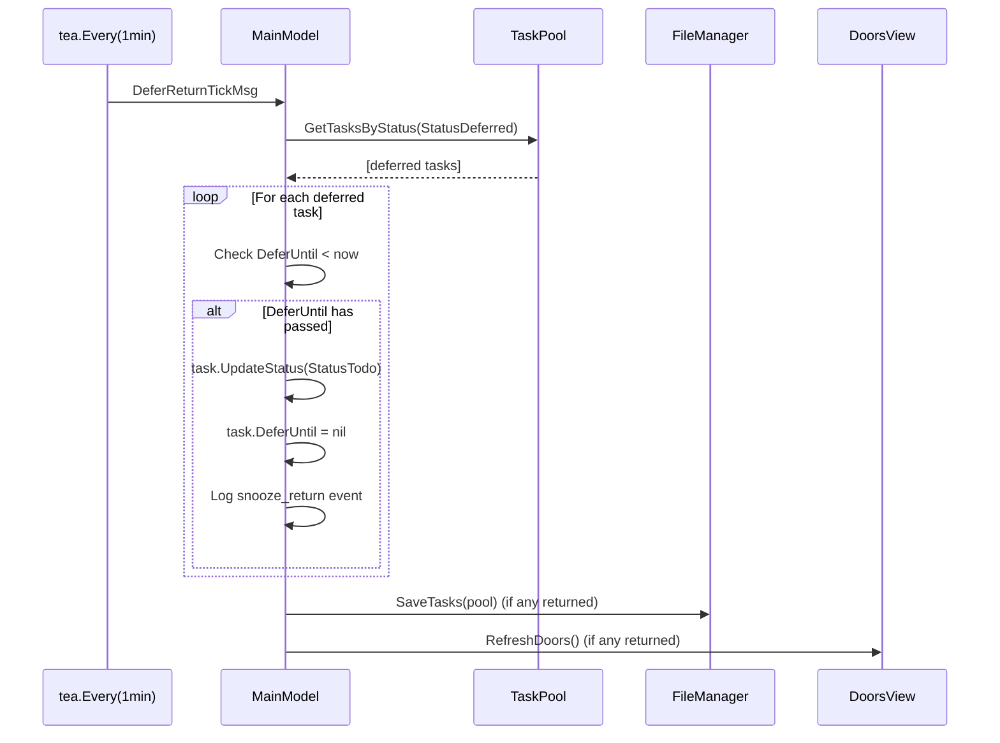

# Architecture Decision Document — Snooze/Defer as First-Class Action

## Epic 28 Scope

This architecture document covers the technical design for surfacing the existing `StatusDeferred` as a first-class user action with date-based snooze. It extends the existing ThreeDoors architecture documented in `docs/architecture/`.

## Project Context

ThreeDoors is a Go TUI (Bubbletea) task management app. The `deferred` status already exists in the task model (`internal/core/task_status.go`) with transitions defined (todo->deferred, deferred->todo), but has no TUI surface. This epic adds:

- `Z` key snooze action with quick date options
- `DeferUntil` field for date-based deferral
- Auto-return logic for expired snoozes
- `:deferred` command for managing snoozed tasks

## Architectural Decisions

### ADR-28.1: DeferUntil Field Design

**Decision:** Add `DeferUntil *time.Time` as a nullable pointer field on the `Task` struct.

**Rationale:**
- Nullable pointer: nil means "not deferred" (zero-value safe, no sentinel dates)
- `*time.Time` serializes to YAML `null` when nil, clean `2026-03-08T09:00:00Z` when set
- "Someday" snooze = `StatusDeferred` with nil `DeferUntil` (indefinite, manual un-snooze only)
- Consistent with existing `CompletedAt *time.Time` pattern in the Task model

**Implementation:**

```go
// In internal/core/task.go
type Task struct {
    // ... existing fields ...
    CompletedAt *time.Time `yaml:"completed_at,omitempty"`
    DeferUntil  *time.Time `yaml:"defer_until,omitempty"`  // NEW
}
```

**YAML persistence:**

```yaml
tasks:
  - id: a1b2c3d4-...
    text: Review quarterly metrics
    status: deferred
    defer_until: 2026-03-08T09:00:00Z  # Tomorrow 9am
    # ... other fields ...
```

### ADR-28.2: Key Binding — Z for Snooze

**Decision:** Use `Z` key for snooze action. Available in both DoorsView (on selected door) and TaskDetailView.

**Rationale:**
- `S` is already bound to re-roll (S/Down) in DoorsView — no conflict
- `Z` is a natural mnemonic ("Zzz" = sleep/snooze)
- Preserves all existing key bindings without breaking muscle memory
- Consistent availability in both views reduces cognitive load

**Key binding map (additions only):**

| View | Key | Action |
|------|-----|--------|
| DoorsView | `Z` | Open SnoozeView for selected door (requires door selection first) |
| TaskDetailView | `Z` | Open SnoozeView for current task |

### ADR-28.3: Status Transition Extensions

**Decision:** Add two new transitions: `in-progress -> deferred` and `blocked -> deferred`.

**Rationale:**
- Users mid-task should be able to snooze ("I started this but can't finish today")
- Blocked tasks users don't want to see for a week should be snoozable
- Existing: `todo -> deferred` (already defined)
- Return path: `deferred -> todo` (already defined, unchanged)

**Implementation:**

```go
// In internal/core/task_status.go
var validTransitions = map[TaskStatus][]TaskStatus{
    StatusTodo:       {StatusInProgress, StatusBlocked, StatusComplete, StatusDeferred, StatusArchived},
    StatusBlocked:    {StatusTodo, StatusInProgress, StatusComplete, StatusDeferred},  // +StatusDeferred
    StatusInProgress: {StatusBlocked, StatusInReview, StatusComplete, StatusDeferred}, // +StatusDeferred
    StatusInReview:   {StatusInProgress, StatusComplete},
    StatusComplete:   {},
    StatusDeferred:   {StatusTodo},
    StatusArchived:   {},
}
```

### ADR-28.4: Door Selection — No Filter Change Needed

**Decision:** Do NOT modify `GetAvailableForDoors()`. The existing filter already excludes deferred tasks.

**Rationale:**
- Current filter at `internal/core/task_pool.go:81`: `t.Status == StatusTodo || t.Status == StatusBlocked || t.Status == StatusInProgress`
- `StatusDeferred` is not in the inclusion list, so deferred tasks are already excluded
- Auto-return logic handles transitioning expired snoozes back to `todo`, at which point they naturally re-enter the eligible pool
- This is cleaner than adding date-checking logic inside the filter

### ADR-28.5: Auto-Return Logic

**Decision:** Check for expired snoozes in two places: (1) on application startup, (2) via a 1-minute `tea.Tick` during active sessions.

**Rationale:**
- Startup check: ensures tasks return even if the app was closed during the defer period
- `tea.Tick` check: handles tasks returning while the app is open (e.g., snoozed until "today" while user has TUI open across midnight)
- 1-minute interval is sufficient granularity (snooze targets are day-level, not second-level)
- Follows existing pattern: `tea.Every` is already used for session timer ticks

**Implementation:**

```go
// Auto-return message type
type DeferReturnTickMsg time.Time

// In MainModel.Init() or startup sequence
func checkDeferredReturns(pool *TaskPool) tea.Cmd {
    return func() tea.Msg {
        now := time.Now().UTC()
        for _, t := range pool.GetTasksByStatus(StatusDeferred) {
            if t.DeferUntil != nil && t.DeferUntil.Before(now) {
                _ = t.UpdateStatus(StatusTodo)
                t.DeferUntil = nil
            }
        }
        return DeferReturnTickMsg(now)
    }
}

// Periodic tick subscription
func deferReturnTick() tea.Cmd {
    return tea.Every(time.Minute, func(t time.Time) tea.Msg {
        return DeferReturnTickMsg(t)
    })
}
```

### ADR-28.6: Snooze Date Calculation

**Decision:** Calculate snooze dates relative to local time, stored as UTC.

**Quick option date calculations:**

| Option | Calculation | Example (if now = 2026-03-07 14:30 local) |
|--------|-------------|---------------------------------------------|
| Tomorrow | Next day, 09:00 local, converted to UTC | 2026-03-08T09:00:00 local |
| Next Week | Next Monday, 09:00 local, converted to UTC | 2026-03-09T09:00:00 local |
| Pick Date | User-provided date, 09:00 local, converted to UTC | User's choice |
| Someday | nil (no DeferUntil) | Indefinite |

**Rationale:**
- 9:00 AM local is a sensible default — tasks return at start of workday
- UTC storage follows existing project convention (all timestamps in UTC)
- Local-time calculation ensures "Tomorrow" means the user's tomorrow, not UTC tomorrow

## Component Design

### New Component: SnoozeView

**Package:** `internal/tui/`
**File:** `snooze_view.go`

**Responsibility:** Quick date picker overlay for snoozing tasks.

```go
type SnoozeView struct {
    task       *core.Task
    cursor     int           // 0=Tomorrow, 1=Next Week, 2=Pick Date, 3=Someday
    dateInput  textinput.Model // For "Pick Date" option
    inputMode  bool          // true when Pick Date is active
    width      int
    height     int
}

func NewSnoozeView(task *core.Task) SnoozeView
func (v SnoozeView) Update(msg tea.Msg) (SnoozeView, tea.Cmd)
func (v SnoozeView) View() string
```

**Key Behaviors:**
- Renders as a centered overlay/modal on top of current view
- Arrow keys (up/down) navigate the 4 options
- Enter on Tomorrow/Next Week/Someday: immediate snooze + return to previous view
- Enter on "Pick Date": activates text input for `YYYY-MM-DD` format
- ESC cancels and returns to previous view without changes
- On confirm: sets `task.DeferUntil`, calls `task.UpdateStatus(StatusDeferred)`, emits `TaskSnoozedMsg`

**Message Types:**

```go
type TaskSnoozedMsg struct {
    Task      *core.Task
    DeferDate *time.Time // nil for Someday
    Option    string     // "tomorrow", "next_week", "pick_date", "someday"
}
```

### New Component: DeferredListView

**Package:** `internal/tui/`
**File:** `deferred_list_view.go`

**Responsibility:** Display and manage all currently snoozed tasks.

```go
type DeferredListView struct {
    pool      *core.TaskPool
    tasks     []*core.Task   // filtered + sorted deferred tasks
    cursor    int
    width     int
    height    int
}

func NewDeferredListView(pool *core.TaskPool) DeferredListView
func (v DeferredListView) Update(msg tea.Msg) (DeferredListView, tea.Cmd)
func (v DeferredListView) View() string
```

**Key Behaviors:**
- Lists deferred tasks sorted by `DeferUntil` (soonest first, nil/"Someday" last)
- Each row shows: task text (truncated), return date (or "Someday"), time remaining
- `u` key: un-snooze selected task (set status=todo, clear DeferUntil)
- `e` key: edit snooze date (opens SnoozeView for the selected task)
- `j`/`k` or arrow navigation
- ESC returns to previous view
- Accessible via `:deferred` command in command palette

**Rendering:**

```
┌─ Snoozed Tasks ──────────────────────────────────────────┐
│                                                           │
│  1. Review quarterly metrics      Tomorrow (Mar 8)        │
│  2. Update team documentation     Next Week (Mar 10)      │
│  3. Research new frameworks       Apr 1 (24 days)         │
│  4. Reorganize bookmarks          Someday                 │
│                                                           │
│  [u] Un-snooze  [e] Edit date  [ESC] Back                │
└───────────────────────────────────────────────────────────┘
```

### Modified Component: DoorsView

**File:** `internal/tui/doors_view.go` (existing)

**Changes:**
- Add `Z` key handler: if a door is selected, open SnoozeView for that task
- Handle `TaskSnoozedMsg`: refresh doors after snooze (snoozed task removed from pool)

### Modified Component: TaskDetailView

**File:** `internal/tui/task_detail_view.go` (existing)

**Changes:**
- Add `Z` key handler: open SnoozeView for current task
- Handle `TaskSnoozedMsg`: return to doors view after snooze
- Add "[Z] Snooze" to the options bar in the rendered view

### Modified Component: MainModel

**File:** `internal/tui/main_model.go` (existing)

**Changes:**
- Add `:deferred` to command palette routing
- Handle `DeferReturnTickMsg`: check for expired snoozes, refresh doors if any returned
- Initialize defer-return tick subscription in `Init()`
- Route to/from SnoozeView and DeferredListView

### Modified Component: CommandPalette

**Changes:**
- Add `:deferred` command → opens DeferredListView

## Data Flow

### Snooze Flow



### Auto-Return Flow



## Session Metrics

New event types for JSONL session log:

```json
{"type": "snooze", "task_id": "abc-123", "defer_until": "2026-03-08T14:00:00Z", "option": "tomorrow", "timestamp": "2026-03-07T14:30:00Z"}
{"type": "snooze_return", "task_id": "abc-123", "timestamp": "2026-03-08T14:00:15Z"}
{"type": "unsnooze", "task_id": "abc-123", "timestamp": "2026-03-07T16:00:00Z"}
```

## File Impact Summary

| File | Change Type | Description |
|------|------------|-------------|
| `internal/core/task.go` | Modify | Add `DeferUntil *time.Time` field |
| `internal/core/task_status.go` | Modify | Add blocked/in-progress -> deferred transitions |
| `internal/tui/snooze_view.go` | New | SnoozeView component |
| `internal/tui/deferred_list_view.go` | New | DeferredListView component |
| `internal/tui/doors_view.go` | Modify | Add Z-key handler |
| `internal/tui/task_detail_view.go` | Modify | Add Z-key handler |
| `internal/tui/main_model.go` | Modify | Route snooze/deferred views, auto-return tick |
| `internal/tui/command_palette.go` | Modify | Add `:deferred` command |
| `internal/tui/styles.go` | Modify | Styles for snooze/deferred views (if needed) |

## Testing Strategy

| Test Type | Scope | Priority |
|-----------|-------|----------|
| Unit | DeferUntil field serialization/deserialization (YAML round-trip) | P0 |
| Unit | New status transitions (in-progress->deferred, blocked->deferred) | P0 |
| Unit | Auto-return logic (DeferUntil in past triggers todo transition) | P0 |
| Unit | Snooze date calculation (Tomorrow, Next Week, local-to-UTC) | P0 |
| Unit | "Someday" handling (nil DeferUntil, no auto-return) | P0 |
| Integration | Full snooze flow (select door -> Z -> option -> verify gone from doors) | P1 |
| Integration | Auto-return flow (snooze -> advance time -> verify task returns) | P1 |
| Golden file | SnoozeView rendered output | P1 |
| Golden file | DeferredListView rendered output | P1 |
| Edge case | DeferUntil exactly at boundary (now == DeferUntil) | P2 |
| Edge case | Snooze task that was in-progress (verify transition works) | P2 |

## Dependencies

This epic has **no dependencies** on other active epics (23, 24, 25, 26). It builds entirely on existing infrastructure:

- `StatusDeferred` (exists in `task_status.go`)
- `validTransitions` map (exists, needs 2-line addition)
- `GetAvailableForDoors()` (already excludes deferred — no change)
- Bubbletea view patterns (DoorsView, DetailView — established)
- YAML persistence with atomic writes (FileManager — established)
- JSONL session metrics logging (established)

## Decisions Summary

| Decision | Status | Rationale | Alternatives Rejected |
|----------|--------|-----------|----------------------|
| DeferUntil as nullable *time.Time field | Adopted | Zero-value safe; nil = not deferred; matches existing CompletedAt pattern | Sentinel date value (magic values are error-prone), separate boolean field (redundant) |
| Z key for snooze action | Adopted | "Zzz" mnemonic; S already bound to re-roll; available in both views | S key (already bound), D key (conflict with delete/done) |
| Add in-progress→deferred and blocked→deferred transitions | Adopted | Users mid-task or blocked should be able to snooze | Only todo→deferred (too restrictive for real workflow) |
| No change to GetAvailableForDoors() filter | Adopted | Deferred already excluded; auto-return handles re-entry | Adding date-check logic to filter (unnecessary complexity) |
| Dual auto-return: startup check + 1-minute tea.Tick | Adopted | Covers both reopened-app and always-running scenarios | Startup-only (misses running sessions), shorter tick interval (wasteful) |
| Local time calculation, UTC storage | Adopted | "Tomorrow" means user's tomorrow; UTC follows project convention | UTC calculation (user-confusing), local storage (inconsistent) |
| SnoozeView as centered overlay modal | Adopted | Minimal disruption; 4 quick options + date picker | Full-screen view (heavyweight), inline picker (layout complexity) |
| DeferredListView via :deferred command | Adopted | Consistent with existing command palette pattern | Always-visible sidebar (wastes space), status bar indicator only (not enough info) |
| JSONL session logging for snooze events | Adopted | Consistent with existing metrics; enables snooze pattern analysis | No logging (loses analytics), separate log file (fragmented) |
