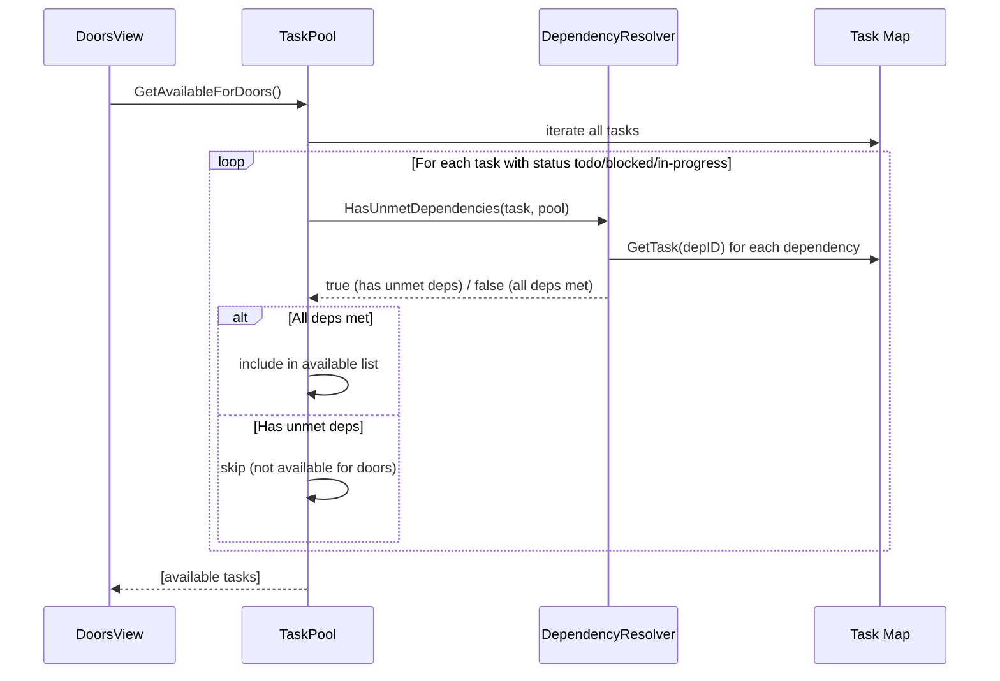
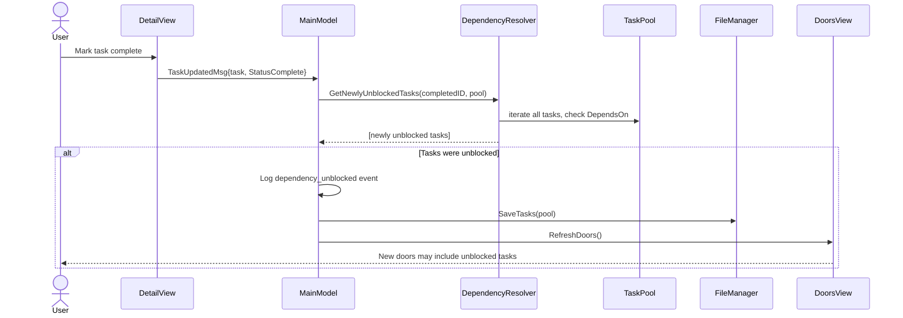
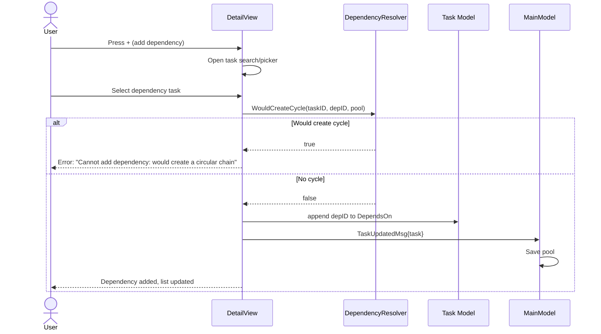

# Architecture Decision Document — Task Dependencies & Blocked-Task Filtering

## Epic 29 Scope

This architecture document covers the technical design for adding a native dependency graph to ThreeDoors tasks, enabling automatic filtering of blocked tasks from door selection. It extends the existing ThreeDoors architecture documented in `docs/architecture/`.

## Project Context

ThreeDoors is a Go TUI (Bubbletea) task management app. The `blocked` status exists but requires manual setting. Cross-references exist in the enrichment DB (`cross_references` table) but track generic "related" relationships, not directed dependency chains. This epic adds:

- `DependsOn []string` field for structural task dependencies
- Automatic filtering of dependency-blocked tasks from door selection
- "Blocked by: [task]" indicator in TUI
- Auto-unblock checking when dependencies complete
- Circular dependency detection and rejection
- Dependency management UI in the detail view

## Architectural Decisions

### ADR-29.1: DependsOn Field Design

**Decision:** Add `DependsOn []string` as a slice of task ID strings on the `Task` struct.

**Rationale:**
- `[]string` stores task UUIDs — the same immutable identifiers already used for task identity
- Serializes cleanly to YAML as a list; empty/nil slice omitted via `omitempty`
- Consistent with existing field patterns (`Tags []string`, `Notes []TaskNote`)
- Cross-provider dependencies are out of scope for v1 — IDs refer to tasks within the same pool
- Task IDs are UUIDs generated in `NewTask()` and never change, so dependency references are stable

**Implementation:**

```go
// In internal/core/task.go
type Task struct {
    // ... existing fields ...
    DeferUntil  *time.Time `yaml:"defer_until,omitempty"`
    DependsOn   []string   `yaml:"depends_on,omitempty"`  // NEW — task IDs that must be complete
}
```

**YAML persistence:**

```yaml
tasks:
  - id: a1b2c3d4-...
    text: Deploy to production
    status: todo
    depends_on:
      - e5f6a7b8-...  # Write deployment script
      - c9d0e1f2-...  # Pass QA review
    # ... other fields ...
```

### ADR-29.2: DependencyResolver Component

**Decision:** Create a standalone `DependencyResolver` in `internal/core/dependency.go` with pure functions — not embedded in TaskPool.

**Rationale:**
- Separation of concerns: TaskPool manages collection, DependencyResolver manages graph logic
- Pure functions are easier to unit test with constructed test data
- No state needed — all functions take pool/task parameters
- Follows the project pattern of standalone components (StatusManager, DoorSelector)

**Implementation:**

```go
// In internal/core/dependency.go

// HasUnmetDependencies returns true if any of the task's dependencies
// are not in complete status. Missing dependencies (orphaned IDs) are
// treated as unmet (pessimistic).
func HasUnmetDependencies(task *Task, pool *TaskPool) bool {
    for _, depID := range task.DependsOn {
        dep := pool.GetTask(depID)
        if dep == nil || dep.Status != StatusComplete {
            return true
        }
    }
    return false
}

// GetBlockingDependencies returns the subset of a task's dependencies
// that are not yet complete. Returns nil if all dependencies are met.
func GetBlockingDependencies(task *Task, pool *TaskPool) []*Task {
    var blocking []*Task
    for _, depID := range task.DependsOn {
        dep := pool.GetTask(depID)
        if dep == nil {
            // Orphaned dependency — create a placeholder for display
            blocking = append(blocking, &Task{
                ID:   depID,
                Text: "[deleted task]",
            })
        } else if dep.Status != StatusComplete {
            blocking = append(blocking, dep)
        }
    }
    return blocking
}

// WouldCreateCycle returns true if adding a dependency from taskID to
// depID would create a circular dependency chain. Uses depth-first
// search through the dependency graph.
func WouldCreateCycle(taskID, depID string, pool *TaskPool) bool {
    // If depID depends (directly or transitively) on taskID, adding
    // taskID -> depID would create a cycle
    visited := make(map[string]bool)
    return hasDependencyPath(depID, taskID, pool, visited)
}

func hasDependencyPath(fromID, toID string, pool *TaskPool, visited map[string]bool) bool {
    if fromID == toID {
        return true
    }
    if visited[fromID] {
        return false
    }
    visited[fromID] = true

    task := pool.GetTask(fromID)
    if task == nil {
        return false
    }
    for _, depID := range task.DependsOn {
        if hasDependencyPath(depID, toID, pool, visited) {
            return true
        }
    }
    return false
}

// GetNewlyUnblockedTasks returns tasks that depended on completedTaskID
// and now have all their dependencies met.
func GetNewlyUnblockedTasks(completedTaskID string, pool *TaskPool) []*Task {
    var unblocked []*Task
    for _, task := range pool.GetAllTasks() {
        for _, depID := range task.DependsOn {
            if depID == completedTaskID {
                if !HasUnmetDependencies(task, pool) {
                    unblocked = append(unblocked, task)
                }
                break
            }
        }
    }
    return unblocked
}
```

### ADR-29.3: Door Selection Filter — Active Dependency Check

**Decision:** Modify `GetAvailableForDoors()` to call `HasUnmetDependencies()` for each candidate task.

**Rationale:**
- Unlike Epic 28's snooze (where deferred status was already excluded by the status filter), dependencies require an active check — a task with status `todo` and unmet dependencies must be filtered out
- Performance: O(n*d) where n=eligible tasks and d=average dependency count. For realistic pools (<1000 tasks, <5 deps each), this is negligible (<1ms)
- The filter runs on every door refresh, ensuring real-time accuracy as dependencies complete

**Implementation:**

```go
// In internal/core/task_pool.go — modified GetAvailableForDoors
func (tp *TaskPool) GetAvailableForDoors() []*Task {
    var available []*Task
    for _, t := range tp.tasks {
        if t.Status == StatusTodo || t.Status == StatusBlocked || t.Status == StatusInProgress {
            // Skip deferred tasks (existing)
            // Skip tasks with unmet dependencies (NEW)
            if HasUnmetDependencies(t, tp) {
                continue
            }
            available = append(available, t)
        }
    }
    return available
}
```

### ADR-29.4: Pessimistic Orphaned Dependency Handling

**Decision:** If a task's `DependsOn` references a task ID that no longer exists in the pool, treat the dependency as unmet (the task stays blocked).

**Rationale:**
- Pessimistic is safer: showing a potentially blocked task violates design principle #5 ("Ready means ready")
- Orphaned dependencies indicate data integrity issues that should surface, not be silently ignored
- The "Blocked by: [deleted task]" indicator gives the user clear feedback to clean up
- A future `ValidateDependencies()` utility can flag orphaned IDs for batch cleanup

**Alternatives Considered:**
- Optimistic (treat missing dep as complete): Rejected — violates trust principle
- Auto-cleanup (remove orphaned dep IDs): Rejected — destructive without user consent

### ADR-29.5: Auto-Unblock on Task Completion

**Decision:** When a task status transitions to `complete`, check all other tasks for newly unblocked dependents by iterating the pool. No reverse index for v1.

**Rationale:**
- Pool iteration is O(n) per completion event — at current scale (<1000 tasks), this is <1ms
- A reverse index (`dependedOnBy map[string][]string`) adds maintenance complexity for negligible performance gain
- The check only runs on completion events (infrequent), not on every door refresh
- Newly unblocked tasks trigger a `DependencyUnblockedMsg` for TUI notification and door refresh

**Implementation:**

```go
// Auto-unblock message type
type DependencyUnblockedMsg struct {
    UnblockedTasks []*Task
    CompletedTask  *Task
}

// Called when a task is marked complete
func checkDependencyUnblocks(completedTask *Task, pool *TaskPool) tea.Cmd {
    return func() tea.Msg {
        unblocked := GetNewlyUnblockedTasks(completedTask.ID, pool)
        if len(unblocked) == 0 {
            return nil
        }
        return DependencyUnblockedMsg{
            UnblockedTasks: unblocked,
            CompletedTask:  completedTask,
        }
    }
}
```

### ADR-29.6: TUI Blocked-By Indicator Design

**Decision:** Show a compact "Blocked by: [task text]" line below the task text in doors view and detail view, truncated to 40 characters with "+N more" count.

**Rationale:**
- Compact display preserves door layout — the indicator is a single line, not a list
- 40 characters is enough to identify the blocking task without overwhelming the door frame
- "+N more" count signals additional blockers without consuming space
- Consistent with the project's information density philosophy — minimal but sufficient

**Rendering:**

```
Doors view (on a door with dependencies):
┌─────────────────────┐
│   [TODO]            │
│                     │
│  Deploy to prod...  │
│  Blocked by: Write  │
│  deployment sc...   │
│  (+1 more)          │
│                     │
└─────────────────────┘

Detail view:
│ Dependencies:                          │
│  [x] Write deployment script           │
│  [ ] Pass QA review  ← blocking        │
│                                         │
│ [+] Add dependency  [-] Remove          │
```

### ADR-29.7: Circular Dependency Detection via DFS

**Decision:** Use depth-first search (DFS) with visited-node tracking to detect cycles before adding a dependency.

**Rationale:**
- DFS is the standard algorithm for cycle detection in directed graphs
- `visited` map prevents infinite loops on existing cycles
- Check runs only when adding a dependency (interactive action), not on every door refresh
- Time complexity O(V+E) where V=tasks and E=total dependencies — negligible at current scale
- Self-dependency (A depends on A) is a degenerate cycle caught by the base case (`fromID == toID`)

## Component Design

### New Component: DependencyResolver

**Package:** `internal/core/`
**File:** `dependency.go`

**Responsibility:** Pure functions for dependency graph analysis — checking unmet dependencies, detecting cycles, finding newly unblocked tasks.

**Functions:**
- `HasUnmetDependencies(task *Task, pool *TaskPool) bool`
- `GetBlockingDependencies(task *Task, pool *TaskPool) []*Task`
- `WouldCreateCycle(taskID, depID string, pool *TaskPool) bool`
- `GetNewlyUnblockedTasks(completedTaskID string, pool *TaskPool) []*Task`

**Key Design:**
- Stateless — all functions take parameters, no struct/receiver
- Pure — no side effects, no I/O, deterministic
- Testable — construct test pools and tasks in unit tests

### Modified Component: TaskPool

**File:** `internal/core/task_pool.go` (existing)

**Changes:**
- `GetAvailableForDoors()`: Add `HasUnmetDependencies()` check to filter out dependency-blocked tasks

### Modified Component: DoorsView

**File:** `internal/tui/doors_view.go` (existing)

**Changes:**
- Render "Blocked by: [task text]" indicator below task text on doors that have incomplete dependencies
- Uses `GetBlockingDependencies()` during `View()` rendering

### Modified Component: TaskDetailView

**File:** `internal/tui/task_detail_view.go` (existing)

**Changes:**
- Display dependency list below notes section (checkbox-style: `[x]` complete, `[ ]` incomplete)
- `+` key: open task search/picker to add dependency
- `-` key: remove selected dependency from the list
- Dependency addition validates via `WouldCreateCycle()` before committing

### Modified Component: MainModel

**File:** `internal/tui/main_model.go` (existing)

**Changes:**
- Handle `DependencyUnblockedMsg`: log event, refresh doors, optionally show brief notification
- Route dependency-related messages (add/remove dependency)
- Save pool after dependency modifications

## Data Flow

### Dependency Filtering Flow



### Auto-Unblock Flow



### Add Dependency Flow



## Session Metrics

New event types for JSONL session log:

```json
{"type": "dependency_added", "task_id": "abc-123", "dependency_id": "def-456", "timestamp": "2026-03-07T14:30:00Z"}
{"type": "dependency_removed", "task_id": "abc-123", "dependency_id": "def-456", "timestamp": "2026-03-07T14:31:00Z"}
{"type": "dependency_unblocked", "task_id": "abc-123", "completed_dependency_id": "def-456", "timestamp": "2026-03-07T15:00:00Z"}
{"type": "dependency_cycle_rejected", "task_id": "abc-123", "attempted_dependency_id": "def-456", "timestamp": "2026-03-07T14:32:00Z"}
```

## File Impact Summary

| File | Change Type | Description |
|------|------------|-------------|
| `internal/core/task.go` | Modify | Add `DependsOn []string` field |
| `internal/core/dependency.go` | New | DependencyResolver functions |
| `internal/core/dependency_test.go` | New | Unit tests for all resolver functions |
| `internal/core/task_pool.go` | Modify | Add dependency check to `GetAvailableForDoors()` |
| `internal/tui/doors_view.go` | Modify | Add "Blocked by" indicator rendering |
| `internal/tui/task_detail_view.go` | Modify | Add dependency list display, +/- key handlers |
| `internal/tui/main_model.go` | Modify | Handle DependencyUnblockedMsg, route dep actions |

## Testing Strategy

| Test Type | Scope | Priority |
|-----------|-------|----------|
| Unit | DependsOn field serialization/deserialization (YAML round-trip) | P0 |
| Unit | HasUnmetDependencies — all deps complete, some incomplete, orphaned ID | P0 |
| Unit | WouldCreateCycle — direct cycle, transitive cycle, self-dependency, no cycle | P0 |
| Unit | GetNewlyUnblockedTasks — single unblock, cascade (A->B->C), no unblock | P0 |
| Unit | GetBlockingDependencies — returns correct blockers, handles orphaned IDs | P0 |
| Unit | GetAvailableForDoors excludes dependency-blocked tasks | P0 |
| Integration | Full flow: add dep -> task filtered from doors -> complete dep -> task reappears | P1 |
| Integration | Auto-unblock cascade: C completes -> B unblocks -> B completes -> A unblocks | P1 |
| Edge case | Self-dependency rejection (A depends on A) | P1 |
| Edge case | Task with 10+ dependencies — verify performance <1ms | P2 |
| Edge case | Empty DependsOn list — no impact on door selection | P2 |
| Golden file | Blocked-by indicator rendering at standard widths | P1 |
| Golden file | Detail view dependency list rendering | P1 |

## Dependencies

This epic has **no dependencies** on other active epics (23, 24, 25, 26, 28). It builds entirely on existing infrastructure:

- `Task` struct (exists in `internal/core/task.go`)
- `TaskPool` with `GetAvailableForDoors()` (exists in `internal/core/task_pool.go`)
- `StatusComplete` constant (exists in `internal/core/task_status.go`)
- Bubbletea view patterns (DoorsView, DetailView — established)
- YAML persistence with atomic writes (FileManager — established)
- JSONL session metrics logging (established)

**Complementary to Epic 28 (Snooze/Defer):** Both epics improve door pool quality through different mechanisms — Epic 28 via time-based filtering, Epic 29 via dependency-based filtering. No code conflicts between them.
