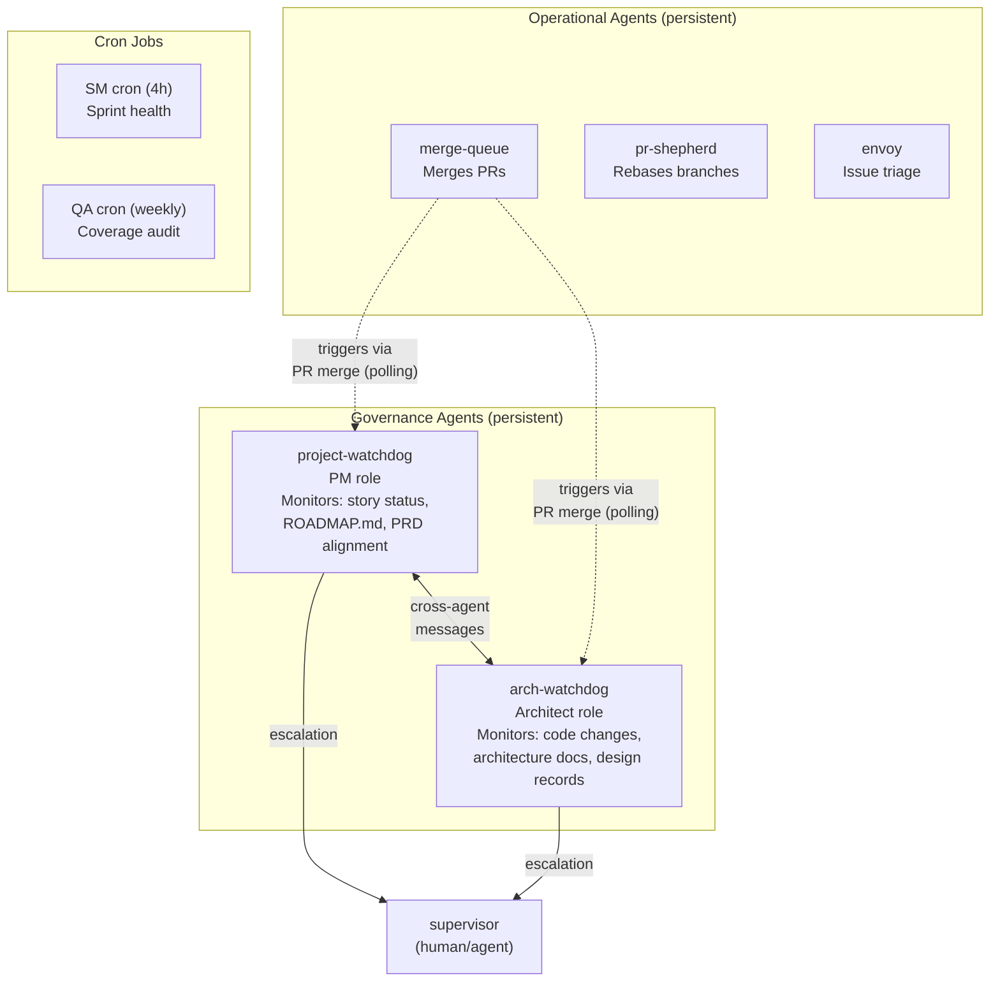
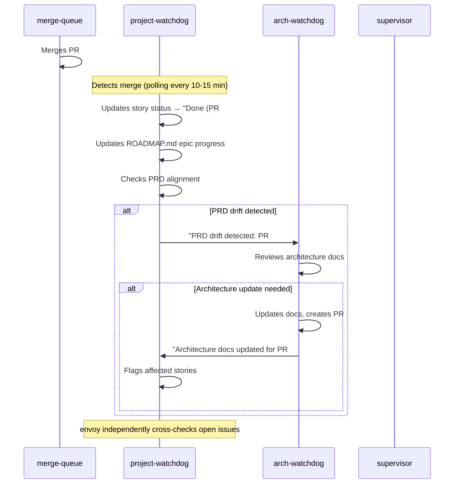

# Agent Governance

This document defines the communication architecture, authority boundaries, and operational safeguards for ThreeDoors persistent agents. It covers the design rationale and reference patterns — agent operational behavior is defined in the individual agent definition files at `agents/<agent-name>.md`.

> **Scope:** Development infrastructure only. This does not modify the ThreeDoors application architecture.

---

## 1. Agent Interaction Architecture

### Topology

The agent topology follows a hub-and-spoke model with two independent monitoring loops:

- **project-watchdog** (PM role) — hub for planning document governance
- **arch-watchdog** (Architect role) — independent loop for architecture compliance
- **merge-queue**, **pr-shepherd**, **envoy** — operational agents with no governance role

The two watchdog agents communicate via point-to-point messages when their domains intersect (e.g., a merged PR that affects both story scope and architecture docs). All other agents operate independently.



### PR Merge Cascade

The primary governance flow triggers on every PR merge. Watchdog agents detect merges via polling — there is no push notification.



### All Persistent Agents

| Agent | Role | Monitoring Surface | Persistence |
|-------|------|-------------------|-------------|
| merge-queue | Merge approved PRs | Open PRs with approvals, CI status | Persistent |
| pr-shepherd | Rebase stale branches | PR branches behind main | Persistent |
| envoy | Issue triage | New/updated GitHub issues | Persistent |
| project-watchdog | Planning governance | Merged PRs, story status, ROADMAP.md, PRD | Persistent |
| arch-watchdog | Architecture compliance | Code changes, architecture docs, design records | Persistent |

Agent definition files: `agents/<agent-name>.md`. See those files for operational details (polling intervals, trigger conditions, escalation rules).

---

## 2. Communication Protocol

### Message Format and Delivery

Agents communicate via `multiclaude message send`:

```bash
multiclaude message send <recipient> "<message text>"
```

Messages are point-to-point and asynchronous. If the recipient is not running, multiclaude queues the message for delivery on startup.

### Correlation IDs

Every message includes a correlation ID to prevent cascade loops:

```
Correlation: PR-NNN
```

The correlation ID is the PR number that triggered the cascade. Agents track recently processed PR numbers (last 50) and skip duplicates.

### Message Types

| Type | Purpose | Example |
|------|---------|---------|
| Notification | Inform another agent of a state change | "Architecture docs updated for pattern change. Correlation: PR-275" |
| Escalation | Request human decision | "Scope change detected: PR #280 introduces feature not in ROADMAP.md. Correlation: PR-280" |
| Cross-agent query | Request domain-specific review | "PRD drift detected: PR #265 changed scope of Epic 28. Verify architecture docs. Correlation: PR-265" |

### Rate Limiting

No agent polls more frequently than once per 10 minutes. This is enforced in each agent's definition file, not centrally.

| Agent | Minimum Poll Interval |
|-------|----------------------|
| merge-queue | 5-10 min |
| pr-shepherd | 10-15 min |
| envoy | 15-20 min |
| project-watchdog | 10-15 min |
| arch-watchdog | 20-30 min |

Messages are sent only on state changes, never as periodic status pings.

---

## 3. Authority Boundaries

### File Domain Separation

Each agent edits only files within its authority domain. Write domains do not overlap.

| Agent | Editable Files | Read-Only Access | Must Escalate |
|-------|---------------|-----------------|---------------|
| project-watchdog | `docs/stories/*.md`, `ROADMAP.md` | All code, all docs | Scope decisions, priority changes, new epic creation |
| arch-watchdog | `docs/architecture/*.md` | All code, all docs | Design decision overrides, code refactoring |
| merge-queue | None (merges PRs) | All | Workflow scope issues (e.g., `.github/workflows/`) |
| pr-shepherd | None (rebases branches) | All | Unresolvable merge conflicts |
| envoy | None (comments on issues) | All | Issue priority or assignment decisions |

### Rationale

- **No overlapping write domains** prevents merge conflicts between agents. project-watchdog writes to story files; arch-watchdog writes to architecture docs. They never edit the same file.
- **Separate worktrees** provide file system isolation. Each agent operates in its own git worktree via multiclaude.
- **No shared state files.** Communication is via messages, not files.

### Out-of-Domain Changes

When an agent needs to change a file outside its domain:

1. **Spawn a worker** — for implementation tasks (e.g., arch-watchdog identifies a code pattern that needs refactoring)
2. **Escalate to supervisor** — for decisions that require human judgment (e.g., project-watchdog detects a scope change not in ROADMAP.md)

Agents never directly edit files outside their domain, even if technically possible.

---

## 4. Anti-Patterns and Safeguards

### Circular Notification Prevention

**Problem:** Agent A messages Agent B about PR #100. Agent B processes PR #100 and messages Agent A. Agent A re-processes PR #100 and messages Agent B again.

**Safeguard:** Correlation IDs. Each message carries `Correlation: PR-NNN`. Agents maintain a set of recently processed PR numbers (last 50). If a message arrives for an already-processed PR, the agent acknowledges but takes no action.

### Authority Creep Prevention

**Problem:** Over time, agents accumulate responsibilities beyond their original scope (e.g., project-watchdog starts editing architecture docs "for convenience").

**Safeguard:** Authority boundaries are embedded directly in each agent's definition file (`agents/<agent-name>.md`). The boundaries are enforced at the agent level, not just documented. Changing boundaries requires updating the definition file and restarting the agent.

### Chatty Agent Prevention

**Problem:** Agents send messages on every poll cycle, regardless of whether anything changed, flooding recipients with noise.

**Safeguard:** Messages are sent only on state changes, never as status pings. An agent that polls and finds nothing new takes no messaging action. The rule is: if nothing changed since last poll, stay silent.

### Idempotency Requirement

**Problem:** An agent processes the same event twice (due to restart, timing overlap, or message retry) and creates duplicate artifacts.

**Safeguard:** All agent operations must be idempotent. Re-processing a previously-seen PR produces no duplicate messages, file edits, or side effects. Agents check current state before acting — if the story file already says "Done (PR #275)", updating it again is a no-op.

---

## 5. Resource Budget and Scaling

### API Calls per Hour

| Agent | Poll Interval | Est. API Calls/Hour | Notes |
|-------|---------------|---------------------|-------|
| merge-queue | 5-10 min | 6-12 | GitHub API for PR status |
| pr-shepherd | 10-15 min | 4-6 | GitHub API for branch status |
| envoy | 15-20 min | 3-4 | GitHub API for issues |
| project-watchdog | 10-15 min | 4-6 | GitHub API for merged PRs + local file reads |
| arch-watchdog | 20-30 min | 2-3 | GitHub API for merged PRs + local file reads |
| **Total persistent** | | **19-31/hour** | |

Cron job additions:
- SM (every 4h): ~6 API calls/day
- QA (weekly): ~1 API call/week

### tmux Session Management

Each persistent agent runs in its own tmux window managed by multiclaude. Five persistent agents occupy five tmux windows. Each agent has its own git worktree, preventing file system conflicts between agents.

### Scaling Limits

- **Recommended maximum:** 6-7 persistent agents before coordination overhead dominates value
- **Current deployment:** 5 persistent agents — within limits
- **Scaling strategy:** When considering a new persistent agent, evaluate whether an existing agent can absorb the responsibility or whether a cron job suffices. Add a new persistent agent only when the monitoring surface requires continuous awareness and message-reactivity.

### When to Consolidate vs. Add Agents

**Add a new agent when:**
- The monitoring surface requires continuous polling (not periodic summarization)
- The domain requires specialized knowledge that existing agents lack
- The write domain does not overlap with any existing agent

**Consolidate instead when:**
- Two agents share the same monitoring surface
- A cron job achieves 70%+ of the value at 10% of the cost
- The new responsibility can be absorbed without exceeding an agent's cognitive load

---

## 6. Lifecycle Management

### Startup

```bash
# Spawn persistent agents (no ordering required)
multiclaude agents spawn --name project-watchdog --class persistent --prompt-file agents/project-watchdog.md
multiclaude agents spawn --name arch-watchdog --class persistent --prompt-file agents/arch-watchdog.md

# Start cron jobs
/loop 4h /bmad-bmm-sprint-status          # SM sprint health
# QA weekly: system crontab or scheduled task
```

**No startup ordering is required.** Agents operate independent polling loops. Either watchdog can start first. If one sends a message before the other is running, multiclaude queues the message for delivery when the recipient starts.

### Monitoring

| Method | Purpose |
|--------|---------|
| `multiclaude worker list` | View agent status (running, stopped, error) |
| `multiclaude logs <agent-name>` | Troubleshoot agent behavior |
| Agent-internal logging | Each agent logs poll cycle count and actions taken |

### Restart Recovery

On restart, agents re-scan the last 10 merged PRs to catch anything missed during downtime. The processed-PR list (last 50) prevents duplicate processing of events the agent already handled before the crash.

**Recovery properties:**
- **No data loss** — agents derive state from git history and the GitHub API, not from in-memory state
- **Idempotent operations** — re-processing a PR produces the same result as processing it once
- **Automatic catch-up** — the 10-PR re-scan window covers typical downtime gaps

**Important:** Agent definitions are baked in at spawn time. Claude cannot hot-reload system prompts. After updating an agent definition file, kill the agent process and respawn it. Telling an agent to "re-read your definition file" is a no-op for behavioral changes.

### Shutdown

```bash
# Stop individual agent
multiclaude worker rm <agent-name>

# Stop all agents (including persistent)
multiclaude stop-all
```

No graceful shutdown sequencing is needed. Agents are stateless (state lives in git and GitHub). Restarting after shutdown follows the same startup procedure with automatic catch-up.
