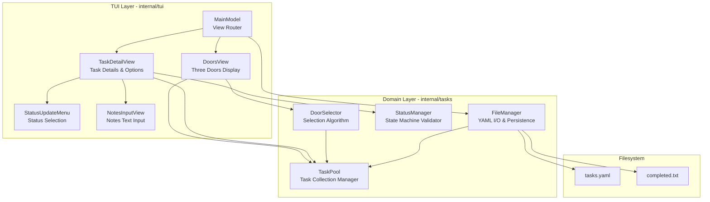

# Components

## Component Overview

### Phase 1: Tech Demo

The application is divided into **two primary layers**:

1. **TUI Layer** (`internal/tui`) - User interface components using Bubbletea
2. **Domain Layer** (`internal/tasks`) - Business logic and data management

### Phase 2–3: Post-MVP Evolution

The architecture expands to **five layers**:

1. **TUI Layer** (`internal/tui`) — Bubbletea views, onboarding, sync status, source badges
2. **Core Domain** (`internal/core`) — Unified task pool, door selection, enrichment, dedup
3. **Adapter Layer** (`internal/adapters`) — Pluggable `TaskProvider` implementations + registry
4. **Sync Engine** (`internal/sync`) — Offline queue, conflict resolution, sync observability
5. **Intelligence Layer** (`internal/intelligence`) — Calendar reader, LLM decomposer, learning engine

## TUI Layer Components

### Component: DoorsView (Three Doors Display)

**Responsibility:** Render the Three Doors interface and handle door selection navigation.

**Key Interfaces:**

**Exposed:**
- `NewDoorsView(pool *TaskPool) *DoorsView` - Constructor
- `Update(msg tea.Msg) (tea.Model, tea.Cmd)` - Bubbletea update handler
- `View() string` - Render doors to terminal

**Consumed:**
- `TaskPool.GetAvailableForDoors() []*Task` - Get tasks for door selection
- `DoorSelection.SelectDoors(pool, 3)` - Generate three random doors

**Dependencies:**
- `internal/tasks.TaskPool` - Source of tasks
- `internal/tasks.DoorSelection` - Door selection logic
- `lipgloss` - Styling and box rendering

**State Managed:**
- `currentDoors` - The three tasks being displayed
- `cursorPosition` - Which door is highlighted (0-2)
- `sessionCompletionCount` - Tasks completed this session

**Key Behaviors:**
- **Keyboard: A/Left, W/Up, D/Right** - Select corresponding door, transition to TaskDetailView. Initially, or after re-rolling, no door is selected.
- **Keyboard: S/Down** - Re-roll doors (generate new selection)
- **Keyboard: C, B, I, E, F, P** - Task management actions (functionality to be implemented in future stories)
- **Keyboard: Q** - Quit application

**Rendering Example:**
The doors will dynamically adjust their width based on the terminal size.
```
┌─────────────────┐  ┌─────────────────┐  ┌─────────────────┐
│   [TODO]        │  │   [BLOCKED]     │  │   [IN-PROGRESS] │
│                 │  │                 │  │                 │
│  Write arch...  │  │  Implement St...│  │  Review PRD...  │
│  (truncated)    │  │  (truncated)    │  │  (truncated)    │
│                 │  │                 │  │                 │
└─────────────────┘  └─────────────────┘  └─────────────────┘

Completed this session: 3
Press A/Left, W/Up, D/Right to select | S/Down to re-roll | Q to quit
Press C (complete), B (blocked), I (in progress), E (expand), F (fork), P (procrastinate) for task actions
Progress over perfection. Just pick one and start. ✨
```

### Component: TaskDetailView

**Responsibility:** Display full task details and provide options for status updates, note-taking, and navigation.

**Key Interfaces:**

**Exposed:**
- `NewTaskDetailView(task *Task, pool *TaskPool) *TaskDetailView` - Constructor
- `Update(msg tea.Msg) (tea.Model, tea.Cmd)` - Bubbletea update handler
- `View() string` - Render task detail screen

**Consumed:**
- `Task.UpdateStatus(newStatus, note)` - Change task status
- `Task.AddNote(text)` - Add progress note
- `Task.SetBlocker(reason)` - Set blocker description
- `TaskPool.UpdateTask(task)` - Persist changes

**State Managed:**
- `currentTask` - The task being viewed
- `viewMode` - "detail" | "status-menu" | "notes-input" | "blocker-input"
- `statusMenuCursor` - Selected status in menu (0-4)
- `notesInputBuffer` - Text being typed for note
- `blockerInputBuffer` - Text being typed for blocker

**Key Behaviors:**
- **Detail View Mode:**
  - **S** - Open status update menu
  - **N** - Open notes input
  - **B** - Mark as blocked (opens blocker input)
  - **ESC** - Return to DoorsView

- **Status Menu Mode:**
  - **Arrow Keys** - Navigate status options
  - **Enter** - Select status, save, return to detail
  - **ESC** - Cancel, return to detail

**Rendering Example:**
```
┌─────────────────────────────────────────────────────────────┐
│ TASK DETAILS                                                │
├─────────────────────────────────────────────────────────────┤
│                                                             │
│ Write architecture document for ThreeDoors                 │
│                                                             │
│ Status: IN-PROGRESS 🟡                                      │
│ Created: 2025-11-07 10:00                                   │
│ Updated: 2025-11-07 14:45                                   │
│                                                             │
│ Notes:                                                      │
│  • [14:15] Started with high-level overview                │
│  • [14:45] Completed data models section                   │
│                                                             │
├─────────────────────────────────────────────────────────────┤
│ Options:                                                    │
│  [S] Update Status  [N] Add Note  [B] Mark Blocked         │
│  [ESC] Return to Doors                                      │
└─────────────────────────────────────────────────────────────┘
```

### Component: StatusUpdateMenu

**Responsibility:** Render status selection menu and validate transitions.

**Key Interfaces:**
- `NewStatusUpdateMenu(currentStatus TaskStatus) *StatusUpdateMenu`
- `Update(msg tea.Msg) (TaskStatus, bool)` - Returns (selectedStatus, confirmed)
- `View() string` - Render menu

**Key Behaviors:**
- Highlights invalid transitions in gray (disabled)
- Shows current status with checkmark
- Arrow keys navigate, Enter confirms, ESC cancels

### Component: NotesInputView

**Responsibility:** Multi-line text input for adding progress notes.

**Dependencies:**
- `bubbles/textarea` - Multi-line text input component

**Key Behaviors:**
- Ctrl+S to save and confirm
- ESC to cancel
- Character counter shows remaining space (1000 chars max)
- Auto-wraps text at terminal width

### Component: MainModel (Root Bubbletea Model)

**Responsibility:** Orchestrate view transitions and manage global application state.

**State Managed:**
- `currentView` - "doors" | "detail"
- `doorsView` - DoorsView instance
- `detailView` - TaskDetailView instance (nil when in doors view)
- `taskPool` - Global TaskPool
- `fileManager` - FileManager for persistence

**Message Types:**
```go
type SelectDoorMsg struct { DoorIndex int }
type ReturnToDoorsMsg struct{}
type TaskUpdatedMsg struct { Task *Task }
type RefreshDoorsMsg struct{}
```

**Message Routing Example:**

```go
func (m MainModel) Update(msg tea.Msg) (tea.Model, tea.Cmd) {
    switch m.currentView {
    case "doors":
        // In doors view - delegate to DoorsView
        newDoorsView, cmd := m.doorsView.Update(msg)
        m.doorsView = newDoorsView.(*DoorsView)

        // Check if user selected a door
        if selectMsg, ok := msg.(SelectDoorMsg); ok {
            task := m.doorsView.GetTask(selectMsg.DoorIndex)
            m.detailView = NewTaskDetailView(task, m.taskPool)
            m.currentView = "detail"
            return m, nil
        }

        return m, cmd

    case "detail":
        // In detail view - delegate to TaskDetailView
        newDetailView, cmd := m.detailView.Update(msg)
        m.detailView = newDetailView.(*TaskDetailView)

        // Check if user wants to return to doors
        if _, ok := msg.(ReturnToDoorsMsg); ok {
            m.detailView = nil
            m.currentView = "doors"
            // Refresh doors to reflect any changes
            m.doorsView.RefreshDoors()
            return m, nil
        }

        // Check if task was updated - save to file
        if updateMsg, ok := msg.(TaskUpdatedMsg); ok {
            m.taskPool.UpdateTask(updateMsg.Task)
            return m, func() tea.Msg {
                if err := m.fileManager.SaveTasks(m.taskPool); err != nil {
                    return ErrorMsg{err}
                }
                return nil
            }
        }

        return m, cmd

    default:
        return m, nil
    }
}
```

## Domain Layer Components

### Component: FileManager

**Responsibility:** Handle all file I/O operations including YAML parsing, atomic writes, and file initialization.

**Key Interfaces:**
- `NewFileManager(config *Config) *FileManager`
- `LoadTasks() (*TaskPool, error)` - Load tasks from tasks.yaml
- `SaveTasks(pool *TaskPool) error` - Save tasks to tasks.yaml (atomic write)
- `AppendCompleted(task *Task) error` - Append to completed.txt
- `InitializeFiles() error` - Create directory and sample files if missing

**Key Behaviors:**

**LoadTasks():**
1. Check if tasks.yaml exists
2. If not, call `InitializeFiles()` to create sample tasks
3. Read and unmarshal YAML
4. Validate all tasks
5. Return populated TaskPool

**SaveTasks():**
1. Marshal TaskPool to YAML
2. Write to `tasks.yaml.tmp`
3. `fsync()` to flush to disk
4. Atomic rename `tasks.yaml.tmp` → `tasks.yaml`

**AppendCompleted():**
1. Format: `[timestamp] task_id | task_text`
2. Atomic append to completed.txt

### Component: TaskPool

**Responsibility:** In-memory management of all tasks, filtering, and recently-shown tracking.

(See Data Models section for full details)

### Component: StatusManager

**Responsibility:** Validate status transitions and enforce state machine rules.

**Key Interfaces:**
- `ValidateTransition(from, to TaskStatus) error` - Check if transition is allowed
- `GetValidTransitions(current TaskStatus) []TaskStatus` - List allowed next states

### Component: DoorSelector

**Responsibility:** Implement door selection algorithm with diversity and randomization.

**Algorithm (Tech Demo - Random Selection):**
- Get available tasks from TaskPool
- Random selection using Fisher-Yates shuffle
- Mark selected tasks as recently shown
- Return DoorSelection with 0-3 tasks

## Component Interaction Diagram



---

## Post-MVP Components (Phase 2–3)

The following components are introduced as the architecture evolves beyond the Tech Demo. They support the 9 new PRD recommendations: adapter SDK, Obsidian integration, sync observability, calendar awareness, multi-source aggregation, LLM decomposition, onboarding, testing infrastructure, and psychology research.

### TUI Layer Additions

#### Component: OnboardingView (Epic 10)

**Responsibility:** Guide first-time users through initial setup — explain Three Doors concept, configure values/goals, walk through key bindings, and optionally import tasks from existing sources.

**Key Interfaces:**
- `NewOnboardingView(config *Config) *OnboardingView`
- `Update(msg tea.Msg) (tea.Model, tea.Cmd)`
- `View() string`

**State Managed:**
- `step` — Current onboarding step (welcome, concept, values, keybindings, import, done)
- `importSource` — Selected import source if any

**Key Behaviors:**
- Sequential wizard flow with Skip option
- Values/goals editor with persistence to config.yaml
- Import step reads from text files or other configured providers
- Sets `onboarding_complete: true` in config on finish

#### Component: SyncStatusBar (Epic 11)

**Responsibility:** Display per-provider sync status in the TUI — connected, syncing, offline, error.

**Key Interfaces:**
- `NewSyncStatusBar(syncEngine *SyncEngine) *SyncStatusBar`
- `View() string` — Render compact status bar

**Key Behaviors:**
- Shows icon per provider: checkmark (synced), arrows (syncing), cloud-off (offline), exclamation (error)
- Updates reactively via Bubbletea messages from SyncEngine
- Compact display fits in TUI footer area

#### Component: SourceBadge (Epic 13)

**Responsibility:** Display source attribution badges on tasks in DoorsView and TaskDetailView.

**Key Behaviors:**
- Short label per provider (e.g., `[TXT]`, `[NOTES]`, `[OBS]`)
- Color-coded by provider for quick visual identification
- Integrated into existing door rendering

### Adapter Layer Components

#### Component: AdapterRegistry (Epic 7)

**Responsibility:** Discover, validate, and manage task provider adapters at runtime based on user configuration.

**Key Interfaces:**

```go
type AdapterRegistry struct {
    providers map[string]TaskProvider
}

func NewAdapterRegistry(config *Config) (*AdapterRegistry, error)
func (r *AdapterRegistry) Register(name string, provider TaskProvider) error
func (r *AdapterRegistry) Get(name string) (TaskProvider, error)
func (r *AdapterRegistry) List() []string
func (r *AdapterRegistry) LoadAll() ([]*Task, error) // aggregate from all providers
```

**Key Behaviors:**
- Reads `providers` section from config.yaml to determine active adapters
- Validates each adapter implements `TaskProvider` interface (contract tests)
- Provides unified `LoadAll()` to aggregate tasks across providers
- Fails gracefully if a provider is unavailable (logs warning, continues with others)

#### Component: TaskProvider Interface (Epic 2/7)

**Responsibility:** Define the contract all task storage adapters must implement.

```go
type TaskProvider interface {
    Name() string
    Load() ([]*Task, error)
    Save(task *Task) error
    Delete(taskID string) error
    Watch() (<-chan ChangeEvent, error)
    HealthCheck() error
}

type ChangeEvent struct {
    Type    ChangeType // Created, Updated, Deleted
    TaskID  string
    Task    *Task      // nil for Deleted
    Source  string     // provider name
}
```

#### Component: TextFileAdapter (Existing, Formalized in Epic 7)

**Responsibility:** Read/write tasks from local YAML files. Evolution of the existing FileManager.

**Implements:** `TaskProvider`

#### Component: AppleNotesAdapter (Epic 2)

**Responsibility:** Bidirectional sync with Apple Notes as task storage backend.

**Key Behaviors:**
- Read tasks via AppleScript bridge or direct SQLite read from NoteStore.sqlite
- Write task updates back to Apple Notes
- Watch for external changes via polling (Apple Notes has no filesystem watch)
- Health check verifies Notes app accessibility

**Dependencies:**
- `os/exec` for AppleScript invocation
- `database/sql` + `modernc.org/sqlite` for direct DB read (optional path)

#### Component: ObsidianAdapter (Epic 8)

**Responsibility:** Read/write tasks from Obsidian vault Markdown files with bidirectional sync.

**Key Interfaces:**
- Implements `TaskProvider`
- Configurable vault path, target folder, and file naming via config.yaml

**Key Behaviors:**
- Parse Markdown files for task items (checkbox syntax: `- [ ]`, `- [x]`)
- Write task changes back as Markdown updates
- Watch vault directory via `fsnotify` for external changes
- Daily note integration: read/write tasks from daily note files
- Respects Obsidian frontmatter and metadata

**Dependencies:**
- `github.com/fsnotify/fsnotify` — filesystem watching
- Markdown parser for task extraction

#### Component: PluginSDK (Epic 7)

**Responsibility:** Provide developer-facing tools and documentation for third-party adapter development.

**Deliverables:**
- `TaskProvider` interface specification (Go interface + documentation)
- Contract test suite that validates any adapter implementation
- Example adapter template
- Developer guide with integration patterns

### Sync Engine Components

#### Component: SyncEngine (Epic 11)

**Responsibility:** Orchestrate sync operations across all configured providers with offline-first semantics.

**Key Interfaces:**

```go
type SyncEngine struct {
    queue         *OfflineQueue
    providers     *AdapterRegistry
    conflictStrat ConflictStrategy
    log           *SyncLog
}

func NewSyncEngine(registry *AdapterRegistry, config *SyncConfig) *SyncEngine
func (s *SyncEngine) QueueChange(change ChangeEvent) error
func (s *SyncEngine) Replay() error  // replay queued changes when online
func (s *SyncEngine) Status() map[string]ProviderSyncStatus
func (s *SyncEngine) ResolveConflict(conflictID string, resolution Resolution) error
```

**Key Behaviors:**
- All local changes are queued immediately (succeed offline)
- Background goroutine replays queue when providers become available
- Per-provider sync state tracking (last sync time, pending changes, errors)
- Conflict detection when remote changes overlap with queued local changes

#### Component: OfflineQueue (Epic 11)

**Responsibility:** Persist local changes when providers are unavailable for later replay.

**Key Behaviors:**
- Append-only queue stored in `~/.threedoors/sync-state/queue.jsonl`
- Each entry: timestamp, provider, operation type, task data
- Replay in chronological order on reconnection
- Entries removed after successful replay

#### Component: ConflictResolver (Epic 11)

**Responsibility:** Detect and resolve sync conflicts between local and remote state.

**Strategy:**
- Default: last-write-wins (timestamp comparison)
- Complex conflicts surface to user via TUI conflict visualization
- User can choose: keep local, keep remote, or merge manually

#### Component: SyncLog (Epic 11)

**Responsibility:** Maintain audit log for debugging sync issues.

**Storage:** `~/.threedoors/sync-state/sync.log` (rotating, max 10MB)

### Intelligence Layer Components

#### Component: CalendarReader (Epic 12)

**Responsibility:** Read local calendar sources to determine upcoming events and available time blocks. Strictly local-first — no OAuth, no cloud APIs.

**Key Interfaces:**

```go
type CalendarReader interface {
    GetEvents(start, end time.Time) ([]CalendarEvent, error)
    GetFreeBlocks(start, end time.Time) ([]TimeBlock, error)
}

type CalendarEvent struct {
    Title    string
    Start    time.Time
    End      time.Time
    AllDay   bool
}

type TimeBlock struct {
    Start    time.Time
    End      time.Time
    Duration time.Duration
}
```

**Implementations:**
- `AppleScriptCalendarReader` — reads macOS Calendar.app via AppleScript
- `ICSCalendarReader` — parses `.ics` files directly
- `CalDAVCacheReader` — reads local CalDAV cache

**Key Behaviors:**
- Returns available time blocks for today/this week
- DoorSelector uses time context to prefer tasks matching available duration
- Falls back gracefully if no calendar sources configured

#### Component: LLMTaskDecomposer (Epic 14)

**Responsibility:** Break user-selected tasks into implementable stories/specs using an LLM, outputting to git repositories for coding agent pickup.

**Key Interfaces:**

```go
type LLMTaskDecomposer struct {
    backend LLMBackend
    config  *LLMConfig
}

type LLMBackend interface {
    Complete(prompt string) (string, error)
}

func (d *LLMTaskDecomposer) Decompose(task *Task) ([]StorySpec, error)
func (d *LLMTaskDecomposer) OutputToGit(specs []StorySpec, repoPath string) error
```

**Key Behaviors:**
- User initiates decomposition from TaskDetailView (explicit action, not automatic)
- LLM generates BMAD-style stories/specs from task description + context
- Output written to configured git repo structure for Claude Code / multiclaude pickup
- Configurable backends: local (Ollama, llama.cpp) or cloud (Anthropic, OpenAI)
- Spike-first approach: prompt engineering and output quality validated before full build

**Dependencies:**
- HTTP client for LLM API calls
- Git operations for output

#### Component: LearningEngine (Epic 4, enhanced in Epic 12)

**Responsibility:** Analyze session metrics and adapt door selection based on user patterns, mood, and calendar context.

**Key Behaviors:**
- Reads JSONL session metrics captured in Epic 1
- Identifies patterns: task types selected vs bypassed, mood correlations
- Calendar-aware: adjusts recommendations based on available time blocks
- Feeds insights into DoorSelector for intelligent selection

### Multi-Source Aggregation Components

#### Component: MultiSourceAggregator (Epic 13)

**Responsibility:** Pull tasks from all configured providers into a unified cross-provider task pool.

**Key Interfaces:**

```go
func NewMultiSourceAggregator(registry *AdapterRegistry) *MultiSourceAggregator
func (a *MultiSourceAggregator) Aggregate() (*TaskPool, error)
func (a *MultiSourceAggregator) GetProviderForTask(taskID string) (TaskProvider, error)
```

**Key Behaviors:**
- Iterates all registered providers via AdapterRegistry
- Tags each task with source provider name
- Delegates writes back to originating provider
- Runs duplicate detection before returning unified pool

#### Component: DuplicateDetector (Epic 13)

**Responsibility:** Flag potential duplicate tasks across providers.

**Key Behaviors:**
- Heuristic matching: normalized text similarity (Levenshtein distance, token overlap)
- Flags potential duplicates for user review (not auto-merge)
- User can confirm duplicate (merge) or dismiss (mark as distinct)
- Stores dedup decisions in enrichment DB to avoid re-flagging

### Dispatch Layer Components (Epic 22)

#### Component: DispatchEngine (Epic 22)

**Responsibility:** Manage the dev dispatch pipeline — queue persistence, multiclaude CLI interaction, guardrail enforcement, and audit logging.

**Package:** `internal/dispatch/`

**Key Interfaces:**

```go
// Dispatcher abstracts the multiclaude CLI for testability.
type Dispatcher interface {
    CreateWorker(ctx context.Context, task string) (workerName string, err error)
    ListWorkers(ctx context.Context) ([]WorkerInfo, error)
    GetHistory(ctx context.Context, limit int) ([]HistoryEntry, error)
    RemoveWorker(ctx context.Context, name string) error
    CheckAvailable(ctx context.Context) error
}

// CommandRunner abstracts subprocess execution for testing.
type CommandRunner interface {
    Run(ctx context.Context, name string, args ...string) ([]byte, error)
}
```

**Concrete Implementation:** `CLIDispatcher` wraps `os/exec` calls to the `multiclaude` binary.

**Key Behaviors:**
- `CreateWorker` builds a rich task description from queue item fields and executes `multiclaude worker create`
- `ListWorkers` parses `multiclaude worker list` output into structured `WorkerInfo` slices
- `GetHistory` parses `multiclaude repo history` output into `HistoryEntry` slices
- `CheckAvailable` validates `multiclaude` is on PATH via `exec.LookPath`
- All subprocess calls use `exec.CommandContext` with 30-second timeout

**Dependencies:**
- `os/exec` for subprocess execution
- `internal/dispatch/model.go` for data types

#### Component: DevQueue (Epic 22)

**Responsibility:** Persist and manage the dev dispatch queue as a YAML file.

**Key Interfaces:**

```go
type DevQueue struct {
    items []QueueItem
    path  string
}

func NewDevQueue(path string) *DevQueue
func (q *DevQueue) Load() error
func (q *DevQueue) Save() error
func (q *DevQueue) Add(item QueueItem) error
func (q *DevQueue) Get(id string) (QueueItem, error)
func (q *DevQueue) Update(id string, fn func(*QueueItem)) error
func (q *DevQueue) List() []QueueItem
```

**Key Behaviors:**
- File location: `~/.threedoors/dev-queue.yaml`
- Atomic write pattern: write to `.tmp`, fsync, rename
- Survives TUI process restarts
- Queue items tagged with status: pending, dispatched, completed, failed

#### Component: GuardrailChecker (Epic 22)

**Responsibility:** Enforce safety limits on dispatch operations.

**Key Behaviors:**
- Max concurrent workers (default 2) — checks `Dispatcher.ListWorkers` count
- Minimum 5-minute cooldown per task between dispatches
- Daily dispatch limit (default 10) — counts from audit log
- Manual approval gate by default (`auto_dispatch: false`)
- All violations produce user-visible TUI messages

#### Component: AuditLogger (Epic 22)

**Responsibility:** Log every dispatch event to JSONL for debugging and daily limit enforcement.

**Storage:** `~/.threedoors/dev-dispatch.log` (append-only JSONL, consistent with `sessions.jsonl` pattern)

**Event Types:** dispatch, complete, fail, kill

#### Component: DevQueueView (Epic 22, TUI Layer)

**Responsibility:** Bubbletea view for managing the dev dispatch queue — list items, approve pending, kill running workers.

**Key Interfaces:**
- `NewDevQueueView(queue *DevQueue, dispatcher Dispatcher) *DevQueueView`
- `Update(msg tea.Msg) (tea.Model, tea.Cmd)`
- `View() string`

**Key Behaviors:**
- List display with status icons (⏳ pending, ⚙️ dispatched, ✅ completed, ❌ failed)
- 'y' approves pending items, 'n' rejects, 'K' kills running workers
- j/k or arrow navigation, ESC returns to previous view
- Accessible via `:devqueue` command in command palette

### Post-MVP Component Interaction Diagram

```mermaid
graph TB
    subgraph TUI[TUI Layer - internal/tui]
        MainModel[MainModel]
        DoorsView[DoorsView + SourceBadges]
        DetailView[TaskDetailView]
        OnboardingView[OnboardingView]
        SyncStatus[SyncStatusBar]
    end

    subgraph Core[Core Domain - internal/core]
        TaskPool[Unified TaskPool]
        DoorSelector[Intelligent DoorSelector]
        StatusMgr[StatusManager]
        Enrichment[EnrichmentStore<br/>SQLite]
        DupDetector[DuplicateDetector]
    end

    subgraph Adapters[Adapter Layer - internal/adapters]
        Registry[AdapterRegistry]
        TextAdapter[TextFileAdapter]
        NotesAdapter[AppleNotesAdapter]
        ObsidianAdapter[ObsidianAdapter]
    end

    subgraph Sync[Sync Engine - internal/sync]
        SyncEngine[SyncEngine]
        Queue[OfflineQueue]
        Conflicts[ConflictResolver]
        SyncLog[SyncLog]
    end

    subgraph Intel[Intelligence - internal/intelligence]
        Calendar[CalendarReader]
        LLM[LLMTaskDecomposer]
        Learning[LearningEngine]
    end

    subgraph Aggregation[Aggregation]
        Aggregator[MultiSourceAggregator]
    end

    MainModel --> DoorsView
    MainModel --> DetailView
    MainModel --> OnboardingView
    MainModel --> SyncStatus

    DoorsView --> DoorSelector
    DoorsView --> TaskPool
    DetailView --> StatusMgr
    DetailView --> LLM

    DoorSelector --> TaskPool
    DoorSelector --> Learning
    DoorSelector --> Calendar

    Aggregator --> Registry
    Aggregator --> DupDetector
    Aggregator --> TaskPool

    Registry --> TextAdapter
    Registry --> NotesAdapter
    Registry --> ObsidianAdapter

    SyncEngine --> Queue
    SyncEngine --> Conflicts
    SyncEngine --> SyncLog
    SyncEngine --> Registry
    SyncStatus --> SyncEngine

    Enrichment -.-> DupDetector
    Learning -.-> Enrichment

    subgraph Dispatch[Dispatch Layer - internal/dispatch]
        DispatchEngine[CLIDispatcher]
        DevQueue[DevQueue<br/>YAML Persistence]
        Guardrails[GuardrailChecker]
        AuditLog[AuditLogger<br/>JSONL]
    end

    subgraph TUI_Dispatch[TUI - Dispatch Views]
        DevQueueView[DevQueueView]
    end

    MainModel --> DevQueueView
    DevQueueView --> DispatchEngine
    DevQueueView --> DevQueue
    DispatchEngine --> Guardrails
    Guardrails --> AuditLog
    DetailView --> DevQueue
    DispatchEngine -.->|os/exec| multiclaude[multiclaude CLI]
```



---
