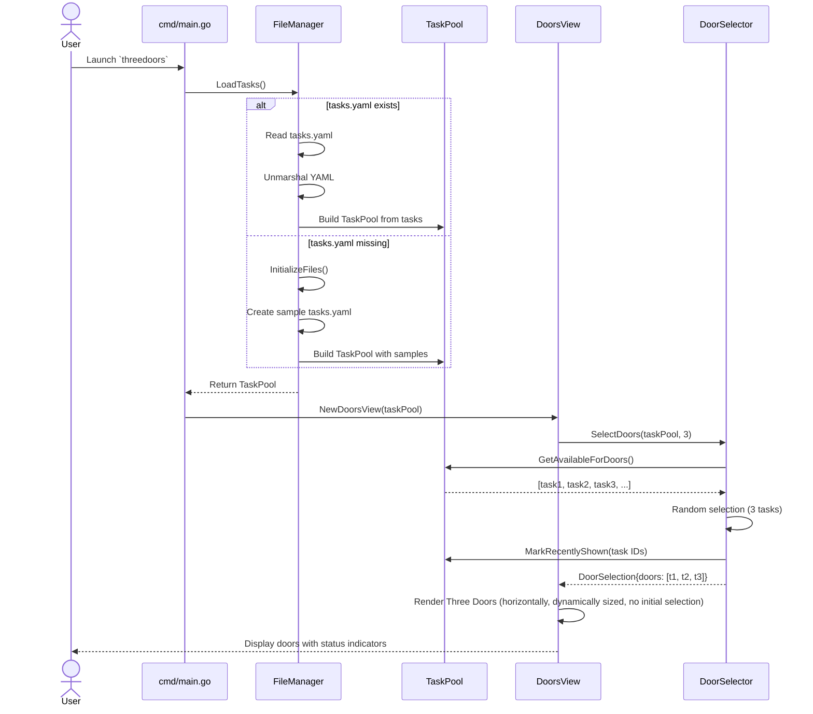
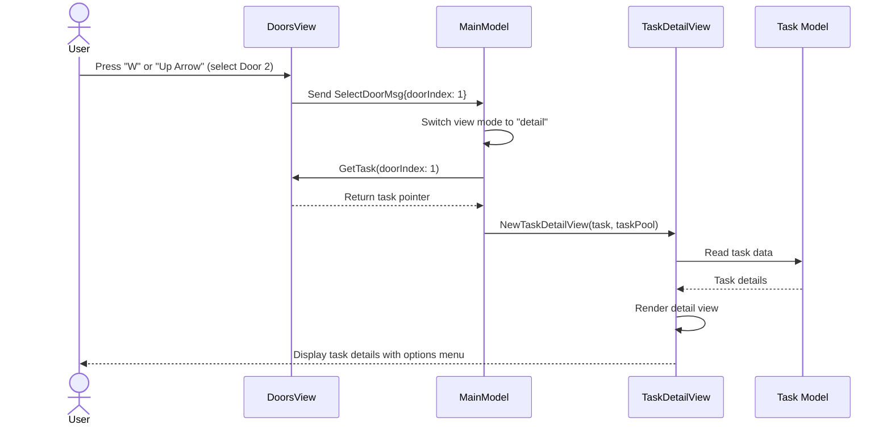
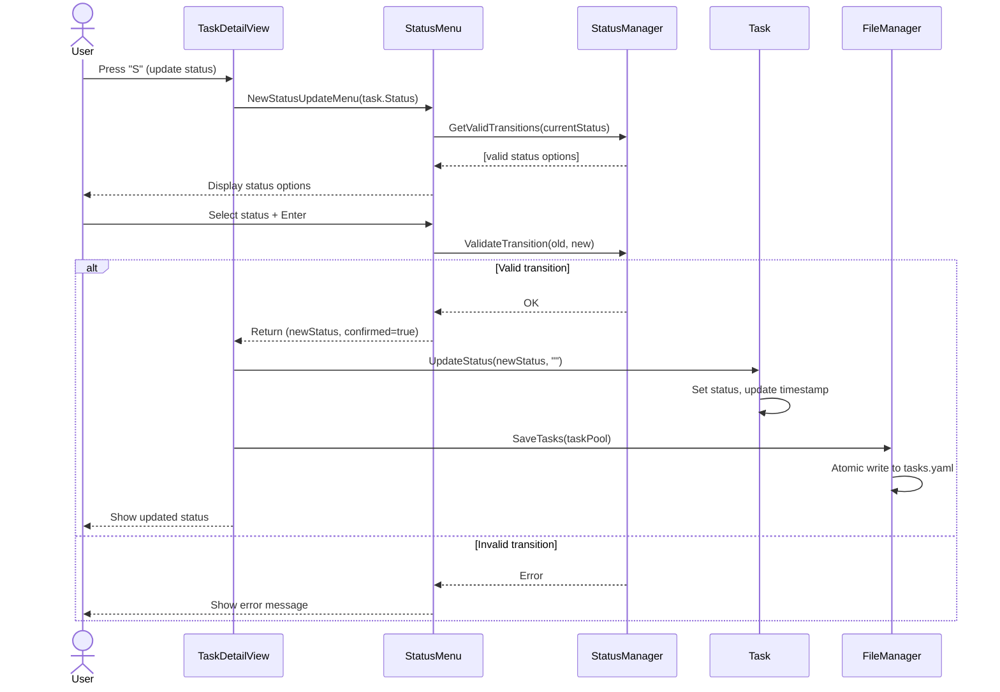
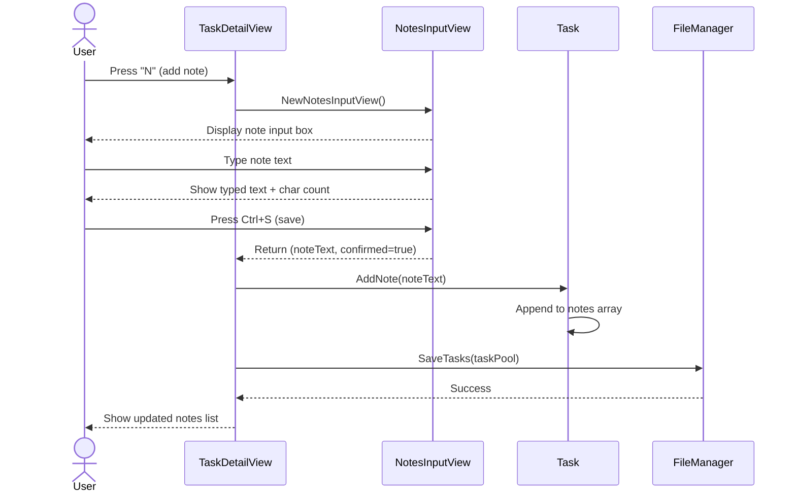
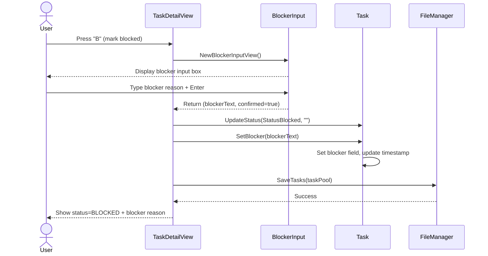
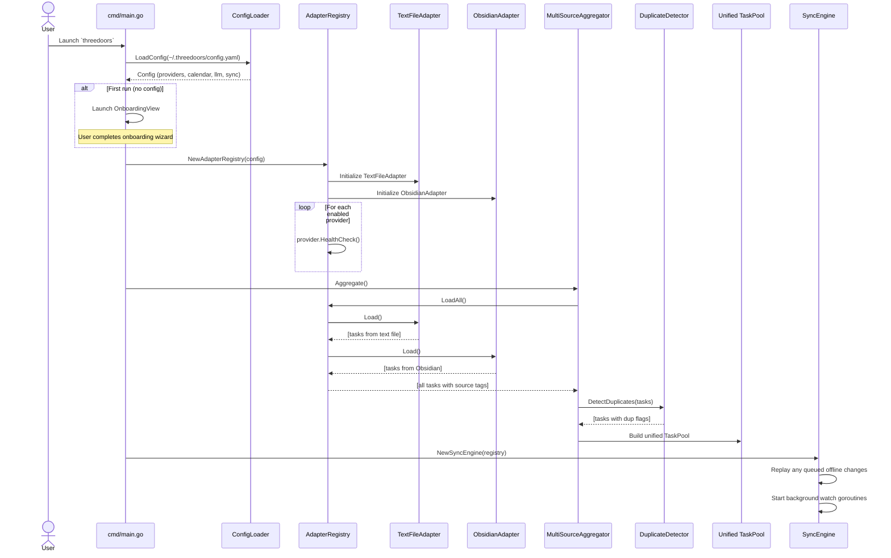
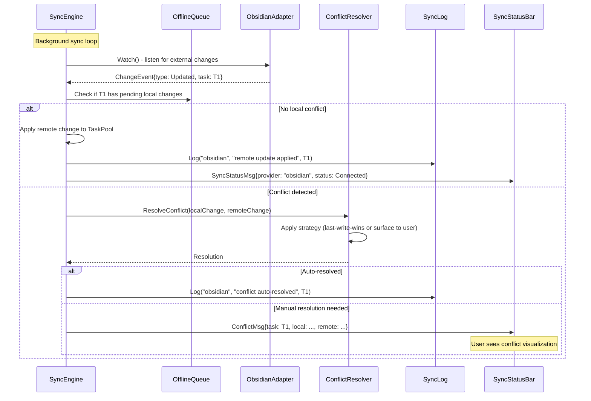
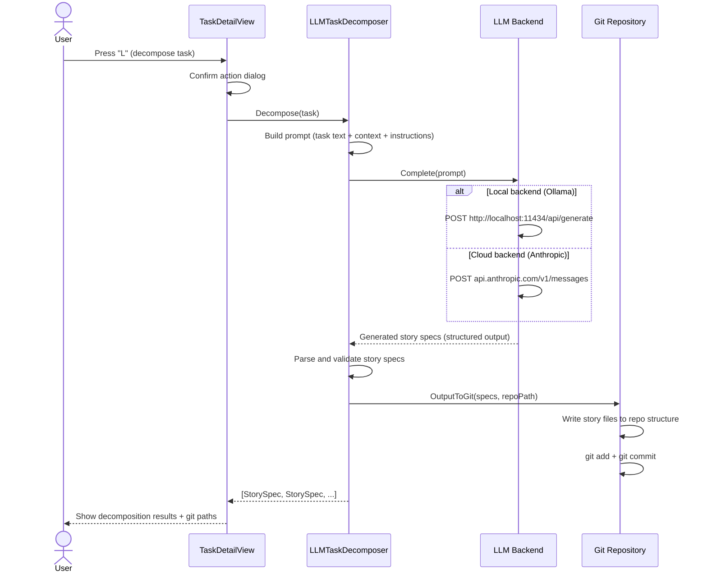
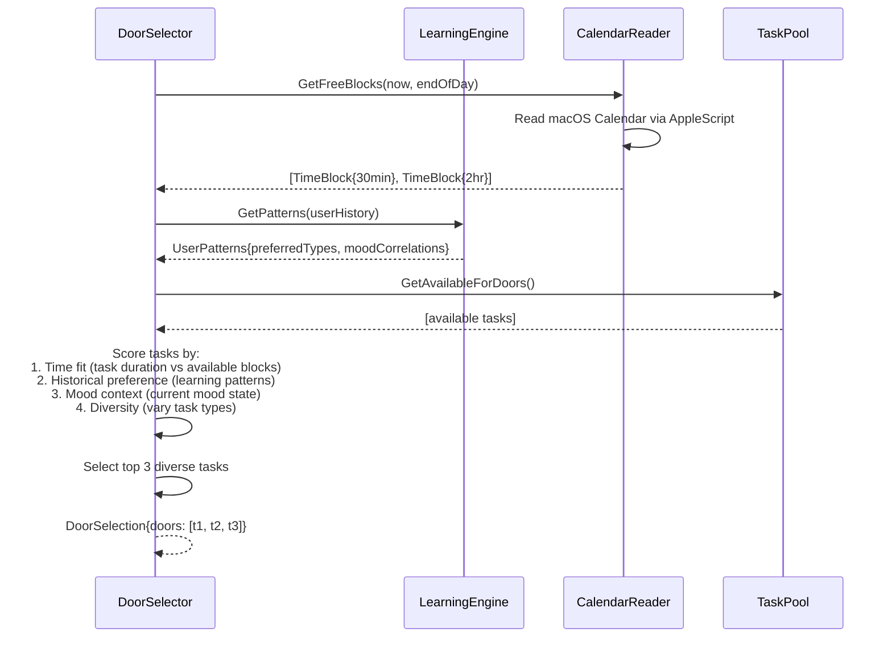

# Core Workflows

## Workflow 1: Application Startup & Three Doors Display

## Workflow 2: Select Door & Enter Task Detail View

## Workflow 3: Update Task Status

## Workflow 4: Add Progress Note

## Workflow 5: Complete Task & Return to Doors

```mermaid
sequenceDiagram
    actor User
    participant TDV as TaskDetailView
    participant Task as Task
    participant TP as TaskPool
    participant FM as FileManager
    participant MM as MainModel
    participant DV as DoorsView

    User->>TDV: Select status=COMPLETE
    TDV->>Task: UpdateStatus(StatusComplete, "")
    Task->>Task: Set status=complete, completedAt=now()

    TDV->>FM: AppendCompleted(task)
    FM->>FM: Atomic append to completed.txt

    TDV->>TP: RemoveTask(task.ID)
    Note over TP: Task removed from active pool

    TDV->>FM: SaveTasks(taskPool)
    FM-->>TDV: Success

    User->>TDV: Press ESC (return to doors)
    TDV->>MM: Send ReturnToDoorsMsg
    MM->>DV: Refresh doors
    DV-->>User: Show new three doors (completed task removed)
```

## Workflow 6: Mark Task as Blocked

## Post-MVP Workflows (Phase 2–3)

### Workflow 7: Multi-Provider Startup & Aggregation

### Workflow 8: Sync with Conflict Detection

### Workflow 9: LLM Task Decomposition

### Workflow 10: Calendar-Aware Door Selection

## Future Task Management Workflows (Architectural Considerations)

The application now includes key bindings for several task management actions that are currently unimplemented: 'c' (complete), 'b' (blocked), 'i' (in progress), 'e' (expand), 'f' (fork), 'p' (procrastinate). These actions represent significant future functionality and will require dedicated workflows and architectural considerations.

**Architectural Implications:**

*   **State Management:** Each action will likely involve updating the state of a `Task` object (e.g., `StatusComplete`, `StatusBlocked`, `StatusInProgress`). This will require robust state transition logic, potentially leveraging the `StatusManager` component.
*   **Persistence:** Changes to task status or properties will need to be persisted. This will involve interactions with the `FileManager` to save updated `TaskPool` data.
*   **Task Expansion/Forking:** The 'e' (expand) and 'f' (fork) actions imply the creation of new tasks or the modification of existing ones. This will require logic to generate new task IDs, potentially split existing task content, and integrate these new tasks into the `TaskPool`. This could have implications for how tasks are uniquely identified and managed.
*   **Procrastination:** The 'p' (procrastinate) action might involve deferring a task, potentially moving it to a different pool or marking it with a future start date. This could introduce new scheduling or prioritization logic.
*   **User Feedback:** Implementing these actions will require clear visual feedback to the user about the success or failure of the operation.

These future workflows will need detailed design and story breakdown in subsequent development phases, with careful consideration of their impact on the existing `Task` model, `TaskPool`, and persistence mechanisms.

---
