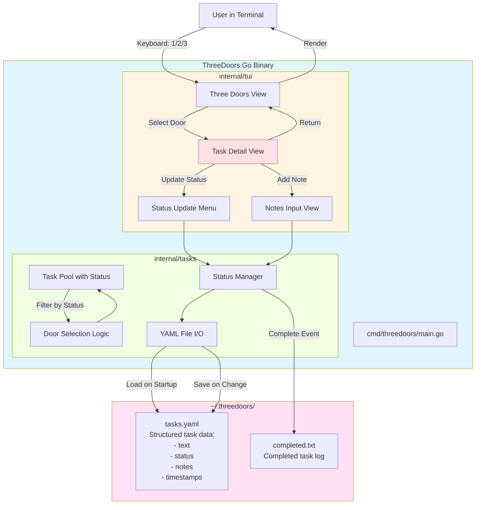

# High Level Architecture

## Technical Summary

ThreeDoors is a **monolithic CLI/TUI application** built in Go that implements a novel task selection interface called "Three Doors." The system follows a **layered architecture** with structured data storage (YAML/JSON) for task metadata including status tracking and notes. The core innovation lies in the UX pattern—presenting three diverse tasks as entry points, then diving deep into task details with status management (todo, blocked, in-progress, in-review, complete) and note-taking capabilities. The architecture uses **Bubbletea** for terminal UI management, YAML parsing for structured task data, and emphasizes rapid validation of the task detail workflow over premature optimization.

## High Level Overview

### Phase 1: Technical Demo — Simple Monolithic CLI

**Architectural Style:** **Simple Monolithic CLI Application**

**Rationale:** The Technical Demo phase prioritizes speed to validation over architectural sophistication. A monolith with direct dependencies allows rapid iteration without navigating abstraction layers.

**Repository Structure:** **Single Repository (Monorepo by default)**

The project uses a standard Go project layout within a single repository:
- `cmd/threedoors/` - Application entry point
- `internal/` - Private application code (tui, tasks packages)
- No need for workspace/multi-module complexity in Tech Demo

**Service Architecture:** **Single Process, No Services**

The application runs as a single Go binary with no external service dependencies:
- No API servers (it IS the interface)
- No databases (YAML file storage)
- No message queues or external integrations
- Pure local execution

**Primary User Interaction Flow:**

1. User launches `threedoors` CLI command
2. App reads `~/.threedoors/tasks.yaml` (structured format with task metadata)
3. Bubbletea TUI renders Three Doors interface (3 randomly selected tasks with status indicators)
4. **User selects door (1/2/3)** → **Enters Task Detail View**
5. **Task Detail View shows:**
   - Full task description
   - Current status (todo/blocked/in-progress/in-review/complete)
   - Existing notes/progress updates
   - **Options menu:**
     - Update status → submenu to select new status
     - Add note → text input for progress notes
     - Mark blocked → capture blocker reason
     - Return to doors → save changes and go back
6. **Status change or note added** → persist to tasks.yaml immediately
7. **Return to Three Doors** → show updated doors (completed tasks removed, status reflected)
8. User can refresh (R) to see different doors or quit (Q)

**Key Architectural Decisions:**

1. **Structured Data Format:** YAML for human-readability and metadata support (status, notes, timestamps)
2. **Persistent Task State:** All status changes and notes written to tasks.yaml immediately
3. **Task Detail View:** New UI component for deep task interaction (not in original PRD)
4. **Status Workflow:** Five states enable proper task lifecycle tracking
5. **Atomic Writes:** All file updates use atomic write pattern to prevent corruption

### Phase 2–3: Post-Validation — Layered Architecture with Adapters

**Architectural Style:** **Layered Monolith with Plugin Adapters**

**Rationale:** After validating the Three Doors UX concept, the architecture evolves to support multiple task providers (Apple Notes, Obsidian, text files), sync infrastructure, calendar awareness, LLM integration, and multi-source aggregation — while keeping the single-binary local-first approach.

**Five-Layer Architecture:**

1. **TUI Layer** (`internal/tui`) — Bubbletea views, keyboard handling, rendering, onboarding flow
2. **Core Domain** (`internal/core`) — Task management, door selection, progress tracking, enrichment
3. **Adapter Layer** (`internal/adapters`) — Pluggable `TaskProvider` implementations behind a registry
4. **Sync Engine** (`internal/sync`) — Offline-first queue, conflict resolution, observability
5. **Intelligence Layer** (`internal/intelligence`) — LLM task decomposition, calendar awareness, learning algorithms

**Key Architectural Principles (Post-MVP):**

- **Dependency Inversion:** Core domain depends on `TaskProvider` interface, not concrete adapters
- **Adapter Registry:** Runtime discovery and config-driven selection of task providers
- **Offline-First:** All operations work locally; sync is asynchronous with queued replay
- **Local-First Calendar:** No OAuth or cloud APIs for calendar; AppleScript, .ics, CalDAV cache only
- **No External Services at Runtime:** LLM integration is opt-in; all core features work without network

**Evolved Service Architecture:** **Single Process, Multiple Adapters**

The application remains a single Go binary but now orchestrates:
- Multiple task provider adapters (text file, Apple Notes, Obsidian, future plugins)
- A sync engine with per-provider state tracking and conflict resolution
- An optional LLM client for task decomposition (local or cloud backends)
- A local calendar reader for time-contextual door selection
- A multi-source aggregator unifying tasks across all providers

**Post-MVP Interaction Flow (additions to Phase 1):**

1. On startup, load `~/.threedoors/config.yaml` to determine active providers
2. **Adapter Registry** loads configured providers (text file, Apple Notes, Obsidian, etc.)
3. **Multi-Source Aggregator** pulls tasks from all providers into unified TaskPool
4. **Duplicate Detector** flags potential cross-provider duplicates
5. **Calendar Reader** (optional) checks local calendars for time context
6. **Door Selector** uses learning patterns + calendar context for intelligent selection
7. Tasks displayed with **source attribution badges** (which provider they came from)
8. On task update, changes written to originating provider + enrichment layer
9. **Sync Engine** queues changes and replays when providers are available
10. **LLM Decomposition** (optional, user-initiated) breaks tasks into stories for coding agents

## High Level Project Diagrams

### Phase 1: Tech Demo Architecture



### Phase 2–3: Post-MVP Layered Architecture

```mermaid
graph TB
    User[User in Terminal]

    subgraph ThreeDoors_Binary[ThreeDoors Go Binary]
        Main[cmd/threedoors/main.go]

        subgraph TUI_Layer[TUI Layer - internal/tui]
            DoorsView[Three Doors View]
            DetailView[Task Detail View]
            OnboardingView[Onboarding Flow]
            SyncStatusBar[Sync Status Indicator]
            SourceBadges[Source Attribution Badges]
        end

        subgraph Core_Domain[Core Domain - internal/core]
            TaskPool[Unified Task Pool]
            DoorSelector[Intelligent Door Selector]
            StatusMgr[Status Manager]
            Enrichment[Enrichment Store]
            DupDetector[Duplicate Detector]
        end

        subgraph Adapter_Layer[Adapter Layer - internal/adapters]
            Registry[Adapter Registry]
            TextAdapter[Text File Adapter]
            AppleNotesAdapter[Apple Notes Adapter]
            ObsidianAdapter[Obsidian Vault Adapter]
            PluginSDK[Plugin SDK Interface]
        end

        subgraph Sync_Engine[Sync Engine - internal/sync]
            OfflineQueue[Offline Change Queue]
            ConflictResolver[Conflict Resolver]
            SyncLog[Sync Log]
            ProviderState[Per-Provider Sync State]
        end

        subgraph Intelligence_Layer[Intelligence - internal/intelligence]
            CalendarReader[Calendar Reader<br/>AppleScript / .ics / CalDAV]
            LLMDecomposer[LLM Task Decomposer]
            LearningEngine[Learning Algorithm]
        end

        subgraph Aggregator[Multi-Source Aggregation]
            MultiSourceAgg[Cross-Provider Aggregator]
        end
    end

    subgraph Local_Storage[~/.threedoors/]
        ConfigYAML[config.yaml]
        TasksYAML[tasks.yaml]
        EnrichmentDB[enrichment.db<br/>SQLite]
        SyncState[sync-state/]
        MetricsLog[metrics.jsonl]
    end

    subgraph External_Sources[External Sources - Local Only]
        AppleNotes[Apple Notes DB<br/>NoteStore.sqlite]
        ObsidianVault[Obsidian Vault<br/>Markdown files]
        Calendar[macOS Calendar<br/>AppleScript / .ics]
        GitRepo[Git Repository<br/>LLM output target]
    end

    subgraph LLM_Backend[LLM Backend - Optional]
        LocalLLM[Local LLM<br/>Ollama / llama.cpp]
        CloudLLM[Cloud LLM<br/>Anthropic / OpenAI]
    end

    User --> TUI_Layer
    TUI_Layer --> Core_Domain
    Core_Domain --> Adapter_Layer
    Core_Domain --> Sync_Engine
    Core_Domain --> Intelligence_Layer
    Core_Domain --> Aggregator

    Registry --> TextAdapter
    Registry --> AppleNotesAdapter
    Registry --> ObsidianAdapter
    Registry --> PluginSDK

    MultiSourceAgg --> Registry
    MultiSourceAgg --> DupDetector

    TextAdapter --> TasksYAML
    AppleNotesAdapter --> AppleNotes
    ObsidianAdapter --> ObsidianVault
    CalendarReader --> Calendar
    LLMDecomposer --> GitRepo
    LLMDecomposer -.->|Optional| LocalLLM
    LLMDecomposer -.->|Optional| CloudLLM

    Enrichment --> EnrichmentDB
    ProviderState --> SyncState
    Main --> ConfigYAML

    style ThreeDoors_Binary fill:#e1f5ff
    style TUI_Layer fill:#fff4e1
    style Core_Domain fill:#f0ffe1
    style Adapter_Layer fill:#e1f0ff
    style Sync_Engine fill:#ffe8e1
    style Intelligence_Layer fill:#f5e1ff
    style Aggregator fill:#e1fff5
    style Local_Storage fill:#ffe1f5
    style External_Sources fill:#f5f5f5
    style LLM_Backend fill:#f0f0f0
```



## Architectural and Design Patterns

**1. Layered Architecture (Simplified)**

**Recommendation: Two-Layer Separation**

**Rationale:**
- Separates UI concerns (Bubbletea event loop) from task management logic
- Allows testing door selection algorithm independently of TUI
- Minimal overhead (~2 packages) vs. flat structure
- Easy to evolve when adding Apple Notes in Epic 2

**Structure:**
- **TUI Layer:** Bubbletea Model/Update/View, keyboard handling, rendering
- **Tasks Layer:** File I/O, task pool management, door selection

**2. Model-View-Update (MVU) Pattern**

**Mandatory for Bubbletea - No Options**

**Description:** Bubbletea enforces the **Elm Architecture (MVU)** pattern:
- **Model:** Application state (current doors, task pool, completion count, UI mode)
- **Update:** Pure functions handling messages (key presses, file load results)
- **View:** Render function transforming model into terminal output

**Rationale:** Framework requirement; aligns with functional reactive patterns; excellent for UI state management.

**3. Adapter / Repository Pattern**

**Tech Demo:** Deferred — only one data source (YAML files), no need to abstract.

**Post-MVP (Epic 2+):** Implement `TaskProvider` interface with concrete adapters:

```go
type TaskProvider interface {
    Name() string
    Load() ([]*Task, error)
    Save(task *Task) error
    Delete(taskID string) error
    Watch() (<-chan ChangeEvent, error) // detect external changes
}
```

**Implementations:**
- `YAMLProvider` — text file backend (from Tech Demo)
- `AppleNotesProvider` — Apple Notes via AppleScript/SQLite
- `ObsidianProvider` — Obsidian vault Markdown files
- Future third-party adapters via Plugin SDK

**4. Adapter Registry Pattern (Epic 7)**

**Decision: Config-driven runtime discovery**

**Rationale:**
- Users configure active providers in `~/.threedoors/config.yaml`
- Registry discovers, validates, and loads adapters at startup
- Enables third-party adapter development without core code changes
- Contract tests validate adapter compliance with `TaskProvider` interface

**4. Dependency Injection (Minimal)**

**Recommendation: Constructor Injection**

**Rationale:**
- Pass file path to tasks package constructor: `tasks.NewManager("~/.threedoors/tasks.yaml")`
- Enables testing with different file paths
- No framework overhead
- Avoids global state issues

**5. Error Handling Strategy**

**Pattern: Errors Are Values (Idiomatic Go)**

**Approach:**
- Return `error` as second value: `func LoadTasks(path string) ([]Task, error)`
- Check errors explicitly at call sites
- Wrap errors with context: `fmt.Errorf("failed to load tasks: %w", err)`
- Display user-friendly messages in TUI layer

**6. State Machine for Task Status**

**Status States:**
- `todo` → Initial state for new tasks
- `blocked` → Task cannot proceed (captures blocker notes)
- `in-progress` → Actively working on task
- `in-review` → Task done, awaiting review/validation
- `complete` → Task fully finished

**Valid Transitions:**
```
todo → in-progress → in-review → complete
todo → blocked → in-progress
in-progress → blocked → in-progress
blocked → todo (unblock)
Any state → complete (force complete)
```

**7. Offline-First / Queue Pattern (Epic 11)**

**Decision: Local change queue with async replay**

**Rationale:**
- All task operations succeed locally even when providers are unavailable
- Changes are queued and replayed when connectivity is restored
- Conflict detection uses last-write-wins as default strategy, with manual override for complex cases

**8. Multi-Source Aggregation Pattern (Epic 13)**

**Decision: Cross-provider unified task pool with dedup**

**Rationale:**
- All configured providers contribute tasks to a single unified pool
- Duplicate detection heuristic flags potential cross-provider duplicates
- Source attribution badges in TUI show task provenance
- Each task retains a reference to its originating provider for write-back

**9. Intelligence Layer Pattern (Epics 12, 14)**

**Decision: Optional intelligence features behind feature gates**

**Rationale:**
- Calendar awareness and LLM decomposition are opt-in
- Calendar reader uses only local sources (AppleScript, .ics, CalDAV cache) — no OAuth
- LLM backends are configurable (local Ollama/llama.cpp or cloud Anthropic/OpenAI)
- LLM output targets git repositories for coding agent pickup (Claude Code, multiclaude)

**Summary of Pattern Decisions:**

| Pattern | Decision | Phase | Rationale |
|---------|----------|-------|-----------|
| **Layered Architecture** | Two-layer (TUI + Tasks) → Five-layer | 1 → 2+ | Evolves from simple to layered as complexity grows |
| **MVU (Bubbletea)** | Required | All | Framework constraint; excellent for UI state |
| **Adapter Pattern** | Deferred → `TaskProvider` interface | 1 → 2 | YAGNI in Tech Demo; essential for multi-backend |
| **Adapter Registry** | Config-driven runtime discovery | 3 | Enables third-party plugins without core changes |
| **Dependency Injection** | Constructor injection | All | Testability without framework overhead |
| **Error Handling** | Idiomatic Go (errors as values) | All | Standard Go practice |
| **Status State Machine** | Five-state workflow | All | Enables complete task lifecycle tracking |
| **Offline-First Queue** | Local queue with async replay | 3 | Core functionality works without network |
| **Multi-Source Aggregation** | Unified pool with dedup + attribution | 3 | Single view across all task providers |
| **Intelligence Layer** | Opt-in features behind gates | 3–4 | Calendar and LLM features are optional |

---
